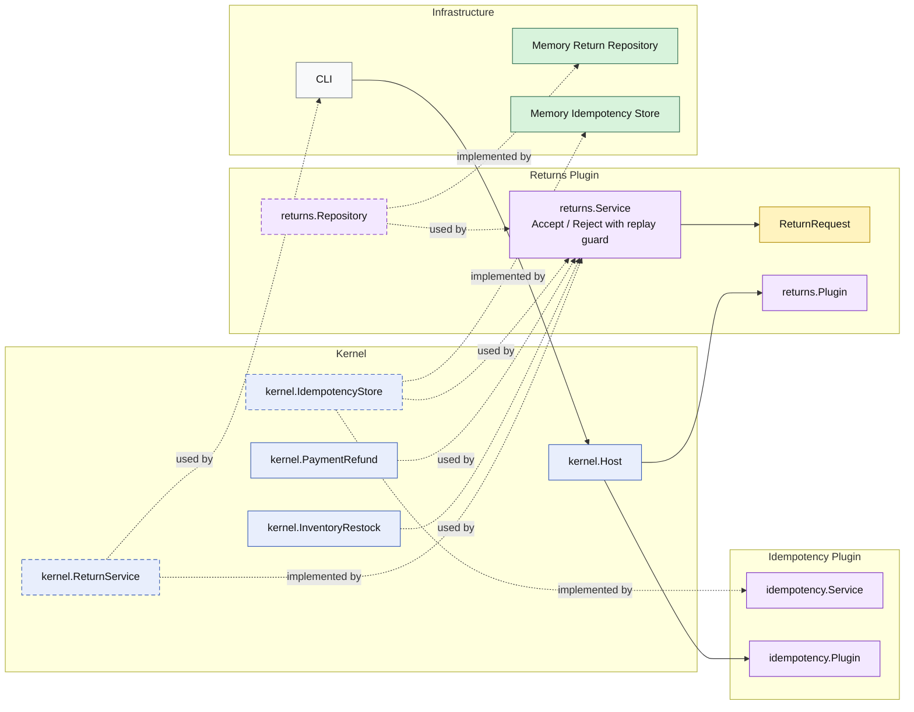

# Lesson 018: Return Command Idempotency Plugin

## Objective

Make the return review commands safe to retry without repeating refund or restock side effects.

## Theory

The return workflow now has:

- actor metadata
- review decisions
- real refund and restock side effects

That makes duplicate command delivery a real operational problem.

A CLI, HTTP adapter, or user action may retry a command because of:

- timeouts
- network uncertainty
- double submission

Without idempotency, a duplicate `AcceptReturn` command could refund twice and restock twice.

In microkernel architecture, this concern should not live inside:

- the return entity
- the payments plugin
- the inventory plugin

Instead, the kernel exposes a focused idempotency capability and a dedicated plugin implements it. The returns plugin can then ask one question before replaying side effects:

- has this command already succeeded for this idempotency key?

## Why This Matters Here

This is a good microkernel lesson because retry safety is cross-cutting, but it still needs a clear owner.

The returns plugin owns the workflow decision to use idempotency.

The idempotency plugin owns the storage of replay results.

That keeps reliability behavior explicit without smearing it across unrelated plugins.

## Diagram

Legend:

- blue: kernel-owned type or contract
- purple: plugin-owned service or plugin registration type
- yellow: plugin-owned domain type
- green: data adapter
- gray: framework edge
- dashed border: contract
- dashed arrow: structural relationship such as `used by` or `implemented by`

## Implementation Focus

- add a kernel-owned idempotency store capability
- implement it with a dedicated idempotency plugin
- require idempotency keys on accept and reject commands
- return the stored result on duplicate retries

Do not add query surfaces yet.

## What To Verify

- `go test ./...` passes
- repeated accept commands reuse the stored result
- repeated reject commands reuse the stored result
- idempotent replays do not trigger refund or restock again
