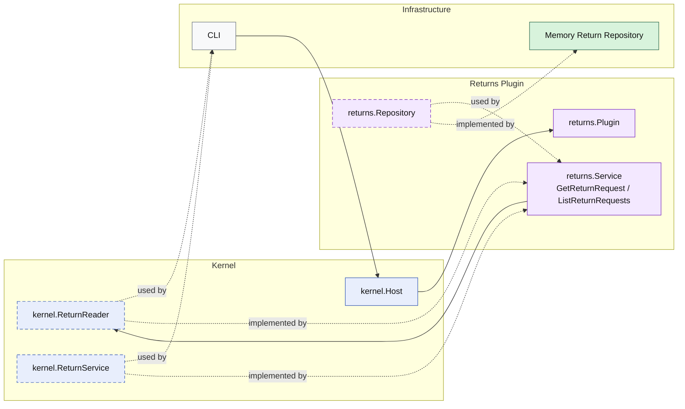

# Lesson 019: Return Query Surface Plugin

## Objective

Add an explicit read surface for return requests so callers load returns through a plugin capability instead of treating the repository as the public interface.

## Theory

The returns workflow already owns a meaningful write side:

- request
- review
- policy check
- refund and restock
- actor metadata
- idempotent review commands

But without explicit queries, callers still have an easy escape hatch:

- read the repository directly

That weakens the microkernel boundary because it makes the repository feel like the real API.

This lesson closes that gap:

- the returns plugin still owns persistence
- the plugin now exposes `GetReturnRequest`
- the plugin now exposes `ListReturnRequests`

So both write and read access go through kernel capabilities instead of leaking storage details to callers.

## Why This Matters Here

In a microkernel, plugin boundaries are not only about workflows and side effects. If reads bypass the plugin capability surface, the architecture quietly drifts toward shared storage with registration wrapped around it.

An explicit return query surface keeps the lesson honest:

- the repository remains internal plumbing
- the plugin owns the read model it chooses to expose
- callers depend on kernel capabilities, not storage details

## Diagram

Legend:

- blue: kernel-owned type or contract
- purple: plugin-owned service or plugin registration type
- green: data adapter
- gray: framework edge
- dashed border: contract
- dashed arrow: structural relationship such as `used by` or `implemented by`

## Implementation Focus

- add a kernel-owned return read capability
- expose `GetReturnRequest`
- expose `ListReturnRequests`
- support repository listing by status

Do not add order or shipment query surfaces yet.

## What To Verify

- `go test ./...` passes
- a stored return request can be loaded through the kernel capability
- return requests can be listed by status
- the demo can load and list returns without direct repository access
