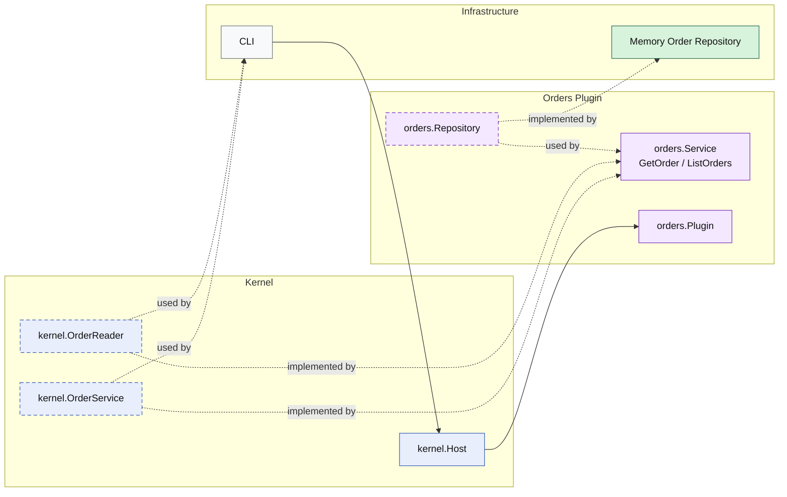

# Lesson 020: Order Query Surface Plugin

## Objective

Add an explicit read surface for orders so callers load orders through a plugin capability instead of treating the repository as the public interface.

## Theory

The orders plugin already owns a meaningful workflow:

- quote conversion
- inventory reservation
- payment capture
- shipment creation
- cancellation
- returnable-order lookup for the returns plugin

But that still leaves one common architectural shortcut:

- reading orders directly from storage

If that becomes normal, the repository starts to feel like the real public API and the plugin boundary weakens.

This lesson closes that gap:

- the orders plugin still owns persistence
- the plugin now exposes `GetOrder`
- the plugin now exposes `ListOrders`

So both write and read access go through kernel capabilities instead of leaking storage details to callers.

## Why This Matters Here

Microkernel boundaries should stay visible on the read side too.

Without that, the system drifts toward this pattern:

- plugin services for commands
- repositories for queries

That quietly turns repositories into shared access points. An explicit order query surface keeps the boundary honest:

- the repository remains internal plumbing
- the plugin owns the read shape it exposes
- callers depend on a kernel capability instead of storage details

## Diagram

Legend:

- blue: kernel-owned type or contract
- purple: plugin-owned service or plugin registration type
- green: data adapter
- gray: framework edge
- dashed border: contract
- dashed arrow: structural relationship such as `used by` or `implemented by`

## Implementation Focus

- add a kernel-owned order read capability
- expose `GetOrder`
- expose `ListOrders`
- support repository listing by status

Do not add shipment query surfaces yet.

## What To Verify

- `go test ./...` passes
- a stored order can be loaded through the kernel capability
- orders can be listed by status
- the demo can load and list orders without direct repository access
