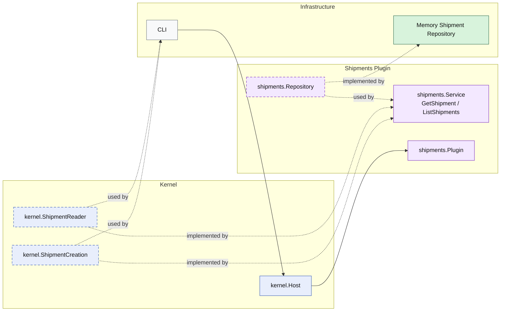

# Lesson 021: Shipment Query Surface Plugin

## Objective

Add an explicit read surface for shipments so callers load shipments through a plugin capability instead of treating the repository as the public interface.

## Theory

The shipments plugin already owns creation:

- receive a shipment request
- build a shipment record
- persist it

But without explicit queries, outside code still has an easy shortcut:

- read shipment storage directly

That weakens the microkernel boundary because the repository starts to look like the real public API.

This lesson closes that gap:

- the shipments plugin still owns persistence
- the plugin now exposes `GetShipment`
- the plugin now exposes `ListShipments`

So both write and read access go through kernel capabilities instead of leaking storage details to callers.

## Why This Matters Here

In a microkernel, even small plugins should own their public read shape.

If callers create through the plugin but read through storage, the architecture quietly drifts toward:

- command methods on plugin services
- queries on repositories

That makes repositories shared access points again. An explicit shipment query surface keeps the plugin boundary visible:

- the repository remains internal plumbing
- the plugin owns the read model it exposes
- callers depend on shipment capabilities, not storage details

## Diagram

Legend:

- blue: kernel-owned type or contract
- purple: plugin-owned service or plugin registration type
- green: data adapter
- gray: framework edge
- dashed border: contract
- dashed arrow: structural relationship such as `used by` or `implemented by`

## Implementation Focus

- add a kernel-owned shipment read capability
- expose `GetShipment`
- expose `ListShipments`
- support repository listing by order id

Do not add quote list queries yet.

## What To Verify

- `go test ./...` passes
- a stored shipment can be loaded through the kernel capability
- shipments can be listed by order id
- the demo can load and list shipments without direct repository access
