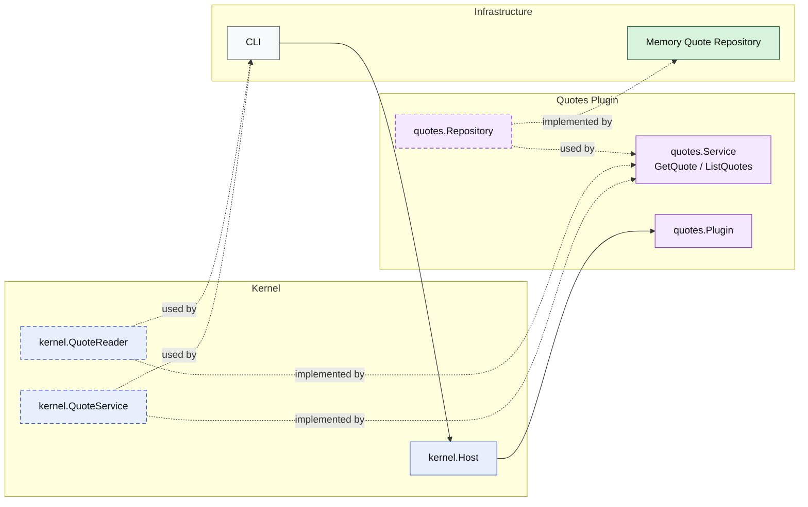

# Lesson 022: Quote List Query Surface Plugin

## Objective

Round out the quote read side by adding list support through a kernel capability instead of treating the repository as the public interface.

## Theory

The quotes plugin already publishes a single-item read:

- `GetQuote`

That was enough to prove the boundary on a simple lookup, but it still left an asymmetry:

- single quote reads through the plugin capability
- multi-quote reads would still tempt callers to reach for storage directly

This lesson closes that gap:

- the quotes plugin still owns persistence
- the plugin now exposes `ListQuotes`
- repository access stays internal to the plugin

So the quote read side is now complete at this level:

- get one quote
- list quotes by status

## Why This Matters Here

In a microkernel, once list queries bypass the plugin capability, repositories quickly become the practical API again.

That weakens the architectural story because the system drifts toward:

- plugin services for writes
- repositories for reporting and browsing

Adding `ListQuotes` keeps the boundary consistent:

- the repository remains internal plumbing
- the quotes plugin owns the read shape it exposes
- callers depend on a quote capability, not on storage internals

## Diagram

Legend:

- blue: kernel-owned type or contract
- purple: plugin-owned service or plugin registration type
- green: data adapter
- gray: framework edge
- dashed border: contract
- dashed arrow: structural relationship such as `used by` or `implemented by`

## Implementation Focus

- keep `GetQuote`
- add `ListQuotes`
- support repository list-by-status
- expose quote reads only through the kernel capability

Do not add product query surfaces yet.

## What To Verify

- `go test ./...` passes
- quotes can be listed by status through the kernel capability
- the demo can load one quote and list approved quotes without direct repository access
