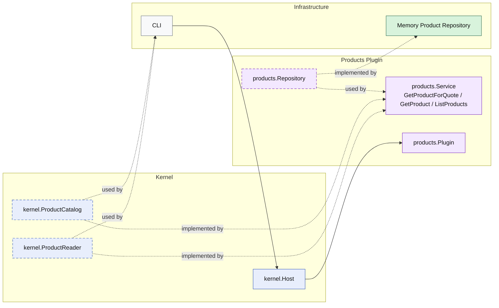

# Lesson 023: Product Query Surface Plugin

## Objective

Promote products from a supporting quote dependency into an explicit read surface with product queries through the plugin boundary.

## Theory

The products plugin already exposes one narrow capability:

- `GetProductForQuote`

That is useful for the quotes workflow, but it is not the same as saying the plugin has a real public read API for product browsing or lookup.

This lesson adds that missing surface:

- the products plugin still supports quote pricing and category lookup
- the plugin now exposes `GetProduct`
- the plugin now exposes `ListProducts`

So the plugin has:

- one specialized capability for quote creation
- one general read surface for product access

## Why This Matters Here

Without explicit product queries, the products plugin remains a helper instead of a visible business boundary.

That encourages a common drift:

- quote workflows use the products plugin
- everything else reads product storage directly

Adding product queries keeps the architecture consistent:

- the repository remains internal plumbing
- the products plugin owns the read shapes it exposes
- callers depend on product capabilities, not storage details

## Diagram

Legend:

- blue: kernel-owned type or contract
- purple: plugin-owned service or plugin registration type
- green: data adapter
- gray: framework edge
- dashed border: contract
- dashed arrow: structural relationship such as `used by` or `implemented by`

## Implementation Focus

- keep `GetProductForQuote`
- add `GetProduct`
- add `ListProducts`
- support category and active filtering in the repository-backed read surface

Do not add customer query surfaces yet.

## What To Verify

- `go test ./...` passes
- a stored product can be loaded through the kernel capability
- products can be listed by category and activity through the kernel capability
- the demo can load and list products without direct repository access
