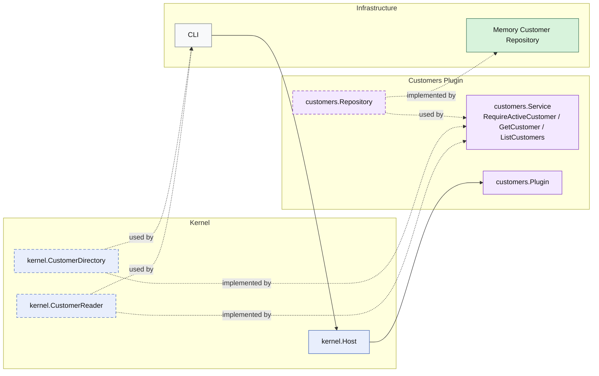

# Lesson 024: Customer Query Surface Plugin

## Objective

Promote customers from a supporting validation dependency into an explicit read surface with customer queries through the plugin boundary.

## Theory

The customers plugin already exposes one narrow capability:

- `RequireActiveCustomer`

That is useful for quote creation, but it does not yet make the plugin a visible public read boundary for customer lookup or browsing.

This lesson adds that missing surface:

- the customers plugin still supports active-customer validation
- the plugin now exposes `GetCustomer`
- the plugin now exposes `ListCustomers`

So the plugin has:

- one specialized capability for validation
- one general read surface for customer access

## Why This Matters Here

Without explicit customer queries, the customers plugin stays a helper and storage becomes the natural place to read customers from.

That weakens the microkernel story because the system drifts toward:

- plugin capabilities for workflow checks
- repositories for ordinary reads

Adding customer queries keeps the boundary consistent:

- the repository remains internal plumbing
- the customers plugin owns the read shapes it exposes
- callers depend on customer capabilities, not storage details

## Diagram

Legend:

- blue: kernel-owned type or contract
- purple: plugin-owned service or plugin registration type
- green: data adapter
- gray: framework edge
- dashed border: contract
- dashed arrow: structural relationship such as `used by` or `implemented by`

## Implementation Focus

- keep `RequireActiveCustomer`
- add `GetCustomer`
- add `ListCustomers`
- support active filtering in the repository-backed read surface

Do not add reporting yet.

## What To Verify

- `go test ./...` passes
- a stored customer can be loaded through the kernel capability
- customers can be listed with active-only filtering through the kernel capability
- the demo can load and list customers without direct repository access
