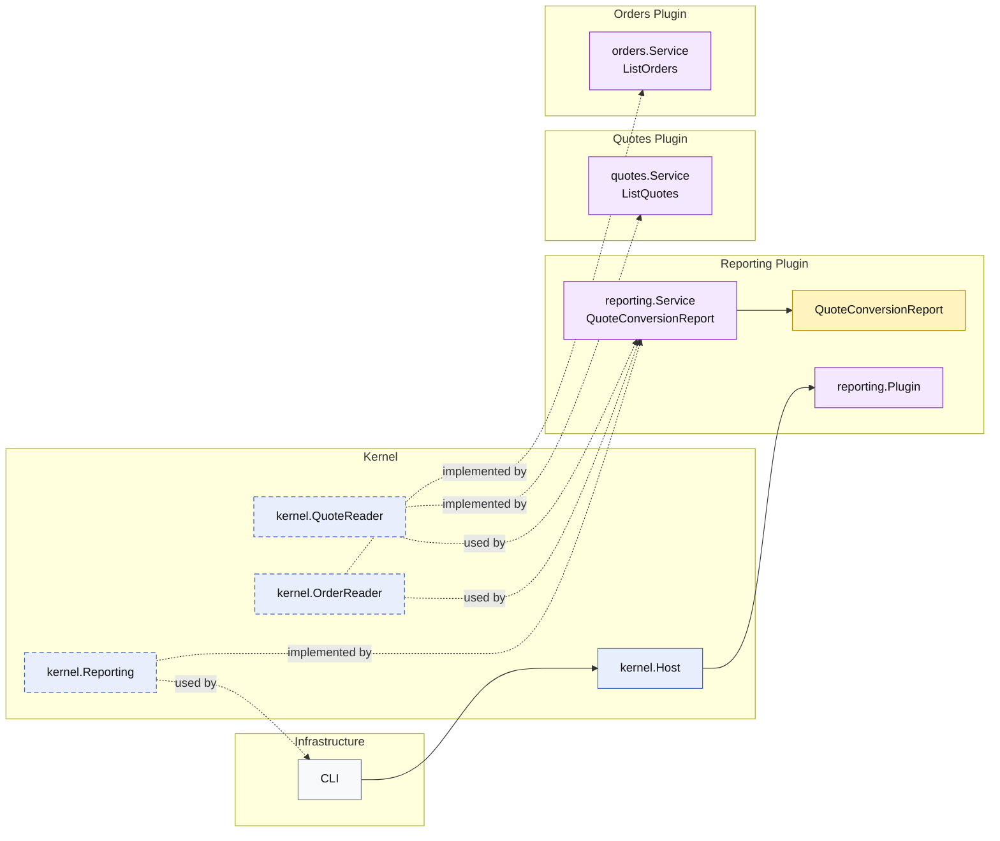

# Lesson 025: Quote Conversion Report Plugin

## Objective

Introduce the first projection-style report in the microkernel track and make it explicit that cross-plugin reporting should still depend on published read capabilities, not on storage access.

## Theory

Up to this point, the microkernel read side has focused on:

- get one thing
- list a group of things

Reports are different.

A report often does not belong to one entity or one plugin record.

Instead, it:

- reads from multiple plugin capabilities
- combines or aggregates those results
- produces a report model with its own meaning

This lesson uses a simple quote conversion report:

- total quotes
- approved quotes
- converted quotes
- conversion rate

The important architectural point is that the report still does not read repositories directly. It depends on the existing `QuoteReader` and `OrderReader` kernel capabilities.

## Why This Matters Here

Cross-plugin reporting is one of the easiest places for a microkernel to lose discipline.

Without a clear home, teams often jump straight to:

- direct repository reads
- storage-shaped reporting code
- adapters that bypass plugin boundaries

This lesson keeps the design honest:

- reporting is a plugin of its own
- it depends on published read capabilities from other plugins
- repositories remain internal to their owning plugins

## Diagram

Legend:

- blue: kernel-owned type or contract
- purple: plugin-owned service or plugin registration type
- yellow: report model
- gray: framework edge
- dashed border: contract
- dashed arrow: structural relationship such as `used by` or `implemented by`

## Implementation Focus

- add a dedicated reporting plugin
- expose `QuoteConversionReport`
- depend on `QuoteReader` and `OrderReader`
- keep repositories out of the reporting plugin

Do not add the other reports yet.

## What To Verify

- `go test ./...` passes
- the report combines quote and order counts correctly
- the demo can render the report output
