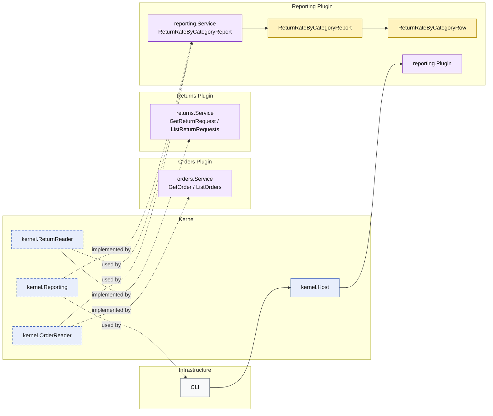

# Lesson 026: Return Rate By Category Report Plugin

## Objective

Add a second projection-style report that combines shipped orders and refunded returns into a category-based business metric without bypassing plugin boundaries.

## Theory

The first reporting lesson showed that a microkernel can publish aggregate read models through a dedicated reporting plugin.

This lesson extends that idea with a more analytics-style question:

- how many units were shipped per category
- how many units were later refunded per category
- what is the resulting return rate

No single plugin owns that metric by itself.

The report depends on:

- `orders` for shipped quantities
- `returns` for refunded quantities

The important architectural point is that the reporting plugin still reads through published kernel capabilities. It does not reach into repositories directly.

## Why This Matters Here

Category-rate metrics are one of the easiest places for a microkernel design to quietly erode.

The usual temptation is:

- read storage tables directly
- join data in infrastructure code
- let reporting bypass plugin contracts because "it is only analytics"

This lesson keeps the architecture honest:

- reporting remains a plugin of its own
- orders and returns publish the read shapes needed for reporting
- aggregation logic stays inside the reporting plugin

## Diagram

Legend:

- blue: kernel-owned type or contract
- purple: plugin-owned service or registration type
- yellow: report model
- gray: framework edge
- dashed border: contract
- dashed arrow: structural relationship such as `used by` or `implemented by`

## Implementation Focus

- add `ReturnRateByCategoryReport`
- enrich published order and return details with line-level category data
- build the report inside the reporting plugin from `OrderReader` and `ReturnReader`

Do not add the other reports yet.

## What To Verify

- `go test ./...` passes
- shipped and refunded quantities are grouped by category correctly
- the demo can render the report output
