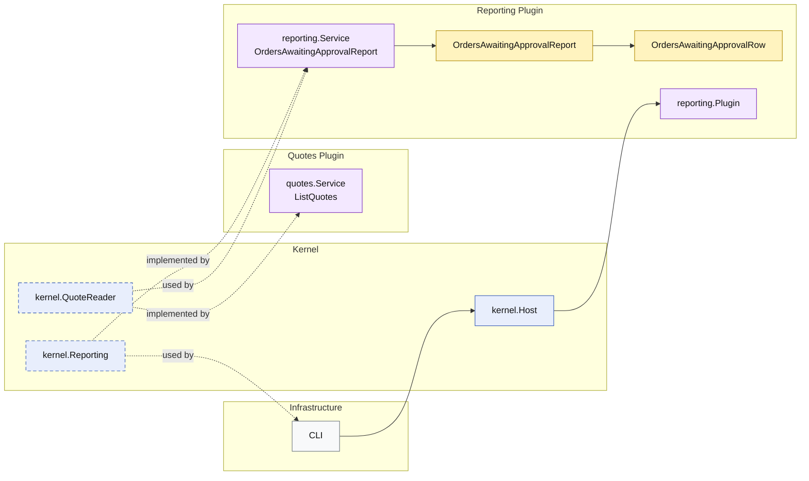

# Lesson 028: Orders Awaiting Approval Report Plugin

## Objective

Add an approval-queue style report that exposes pending approval work as a reporting-plugin projection.

## Theory

The name "orders awaiting approval" is slightly imperfect in this microkernel track.

The current model does not have:

- a separate approval aggregate
- an order that exists before quote approval

What it does have is:

- quotes in `PendingApproval`

So the honest projection is:

- an approval queue over pending-approval quotes

This is still a useful lesson because operational reports do not need to mirror aggregate names mechanically. The reporting plugin can speak in the language of work queues while still being explicit about the underlying model it reads.

## Why This Matters Here

The reporting track already includes:

- conversion metrics
- return analysis
- operational stock visibility

This lesson adds a human workflow queue.

That broadens the reporting story without inventing domain structures the current model does not actually own.

## Diagram

Legend:

- blue: kernel-owned type or contract
- purple: plugin-owned service or registration type
- yellow: report model
- gray: framework edge
- dashed border: contract
- dashed arrow: structural relationship such as `used by` or `implemented by`

## Implementation Focus

- add `OrdersAwaitingApprovalReport`
- enrich the quote read model with `TotalAmount`
- build the queue projection from pending-approval quotes

Do not add a separate approval aggregate or workflow yet.

## What To Verify

- `go test ./...` passes
- pending approval quotes appear in the queue
- line counts and total amounts are surfaced correctly
- the demo can render the approval queue output
