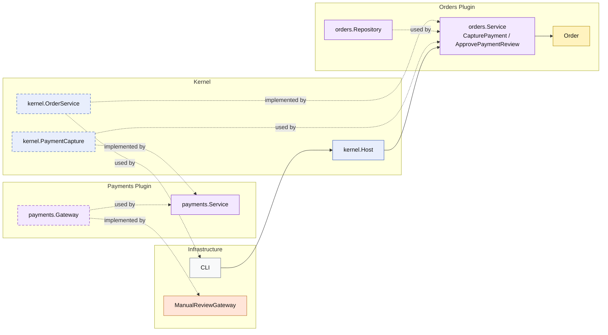

# Lesson 029: Payment Review Workflow Plugin

## Objective

Introduce a payment review state so payment capture can produce a business outcome other than immediate success.

## Theory

Until now, payment capture in the microkernel track has been modeled as:

- success, or
- technical failure

That is too narrow for many real payment integrations.

A gateway may report:

- approve immediately
- send to manual review
- fail technically

The important point is that manual review is not just an error. It is a business outcome that changes workflow state.

In this microkernel, that means:

- the kernel owns the capture outcome contract
- the orders plugin owns the `PendingPayment -> PaymentReview -> Paid` lifecycle
- infrastructure only reports the external capture outcome

## Why This Matters Here

This adds a real branch to the order lifecycle:

- `PendingPayment`
- `PaymentReview`
- `Paid`
- `Shipped`

That makes the workflow more realistic and shows how one plugin can translate another plugin's business outcome into its own state transition without leaking gateway details into the order model.

## Diagram

Legend:

- blue: kernel-owned type or contract
- purple: plugin-owned service or registration type
- yellow: domain type
- orange: behavior adapter
- gray: framework edge
- dashed border: contract
- dashed arrow: structural relationship such as `used by` or `implemented by`

## Implementation Focus

- payment capture returns a business outcome
- review moves the order into `PaymentReview`
- a separate command approves review and moves the order to `Paid`

The code should show:

- a capture outcome contract on the kernel boundary
- `PaymentReview` as an order state
- `ApprovePaymentReview` on the order service
- shipment remaining blocked while the order is still in review

## What To Verify

- `go test ./...` passes
- capture can move an order to `PaymentReview`
- approving payment review moves the order to `Paid`
- shipment is rejected while the order is still in review
