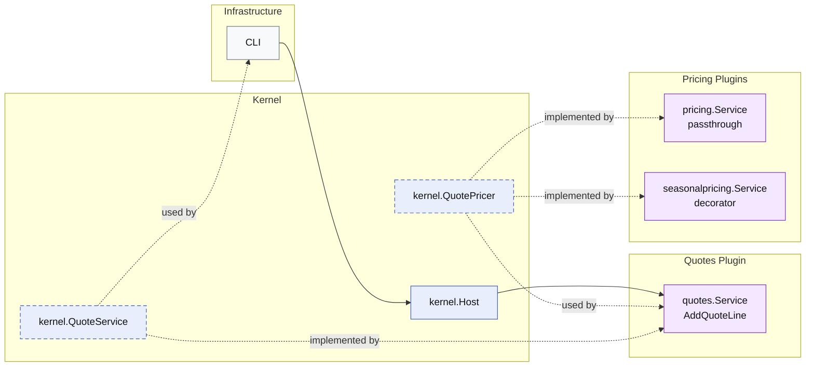

# Lesson 032: Plugin Pricing Extension Point Plugin

## Objective

Add a real extension seam so enabled plugins can change quote-line pricing without changing the `quotes` workflow structure.

## Theory

Up to now, quote pricing in the microkernel track has just been the product's stored unit price.

That proves a simple workflow, but not extensibility.

This lesson adds a different architectural idea:

- the quotes plugin keeps its `AddQuoteLine` use case stable
- the kernel owns a narrow pricing capability
- pricing plugins can publish or decorate that capability

The extension stays deliberately narrow:

- quote-line unit price

The quote workflow does not change, but the effective unit price can change because the enabled plugin set changes.

## Why This Matters Here

A microkernel is not only about workflow slicing. It also needs disciplined places for optional behavior to grow.

Without this seam, every pricing experiment would push conditionals into:

- `quotes.Service`
- `Quote`
- or random infrastructure helpers

With it:

- the quotes plugin still owns quote editing
- the kernel owns the pricing contract
- pricing plugins own price calculation behavior

## Diagram

Legend:

- blue: kernel-owned type or contract
- purple: plugin-owned service or registration type
- gray: framework edge
- dashed border: contract
- dashed arrow: structural relationship such as `used by` or `implemented by`

## Implementation Focus

- add a kernel `QuotePricer` capability
- add a base pricing plugin
- add one sample decorator plugin: `seasonalpricing`

The code should show:

- the quote use case stays structurally stable
- pricing changes only because a pricing plugin is registered
- the extension seam lives at the kernel boundary, not inside the quote entity

## What To Verify

- `go test ./...` passes
- quote pricing works with the base pricer
- registering `seasonalpricing` changes the quote line unit price
- the demo can show the pricing impact
