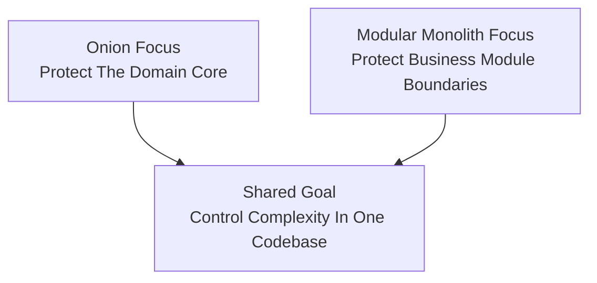

# Lesson 000: From Onion To Modular Monolith

## Objective

Explain how Modular Monolith Architecture relates to Onion Architecture, where they overlap, where they differ, and why it is still worth studying Modular Monolith after finishing the Onion track.

## Short Answer

Modular Monolith and Onion Architecture are compatible ideas, not enemies.

They both care about:

- keeping business logic away from framework details
- preserving clear dependency direction
- making code easier to reason about as the system grows

So yes, part of the difference is semantic.

But it is not only semantic.

Onion Architecture mainly taught this repository to think in terms of:

- a domain-centered core
- an application ring around that core
- infrastructure at the edge

Modular Monolith shifts the emphasis again.

It asks:

- how do we split one deployable codebase into strong business modules?
- how do modules talk to each other without collapsing into one giant shared model?
- how do we keep autonomy inside a single process?

That is a different pressure from Onion’s main question.

## How They Are Related

Both architectures are trying to solve a broad problem:

"How do we stop a growing application from turning into one tangled codebase?"

Onion answered that mostly through:

- ring boundaries
- protected domain logic
- infrastructure pushed outward

Modular Monolith answers it more through:

- explicit module boundaries
- narrow module APIs
- business capabilities that stay cohesive inside one deployable

So this track should not feel like a reset after Onion.

It should feel like moving the design pressure from:

- protecting the core

to:

- protecting module autonomy

## Diagram

## What Is Different

The biggest difference is emphasis.

Onion asks:

- what belongs in the domain?
- what belongs in the application ring?
- how far outward should infrastructure stay?

Modular Monolith asks:

- what is a module?
- what is public between modules?
- what must stay internal to one module?
- how do we stop cross-module coupling from spreading?

So the code can still use entities, services, and repositories.

But the first-class architectural concept becomes:

- the module boundary

rather than:

- the ring boundary

## Is The Difference Mostly Semantic?

Partly, yes.

A careful Onion codebase can evolve into a modular monolith by drawing stronger boundaries between business capabilities.

But the difference is still useful because it changes what you pay attention to.

In Onion, the design question is often:

- is this domain or application?

In Modular Monolith, the design question is often:

- which module owns this?
- should another module depend on this directly?
- what is the stable API between them?

That is not just a rename.

## What Modular Monolith Solves Better In This Comparison

Modular Monolith helps more when the educational pressure becomes:

"How do we keep one deployable from becoming a ball of mud even if the rings are already good?"

That gives it a few useful teaching differences from the Onion track.

### 1. Business Boundaries Become The Main Story

Instead of leading with rings, this architecture leads with business capabilities such as:

- customers
- quotes
- orders
- fulfillment
- returns

That helps students see that internal autonomy is a separate design concern from framework isolation.

### 2. Inter-Module APIs Become Explicit

The question is no longer only:

- what is inside versus outside?

It also becomes:

- how does quotes talk to customers?
- how much of customers should quotes be allowed to know?

That is a different architectural lesson.

### 3. It Teaches A Useful Middle Ground

A modular monolith is still:

- one process
- one deployable
- one codebase

But it tries to gain some of the clarity people often seek from distributed systems without immediately paying the operational cost of microservices.

That is a very practical lesson.

## What Onion Solves Better Or More Naturally

Onion Architecture was stronger in this repository when the question was:

"How do we keep the business core central and insulated?"

That gave it a few natural advantages:

- clearer domain-centered teaching
- clearer inner/outer dependency story
- cleaner explanation of infrastructure at the edge

Modular Monolith can use all of those ideas, but it does not make them its main vocabulary.

So if a student wants maximum clarity around core protection, Onion often teaches that more directly.

## Questions A Student Might Naturally Ask

### "Is Modular Monolith just better package structure?"

No.

Package structure is part of it, but the real point is stronger ownership and narrower APIs between business capabilities.

### "Does it still use domain models and repositories?"

Yes, it can.

This architecture is not anti-domain-model or anti-repository.

It simply changes the first architectural concern from ring purity to module autonomy.

### "Why continue if we already had a protected core?"

Because a protected core does not automatically give you strong business-module boundaries.

Those are separate design pressures.

### "Is this a step toward microservices?"

Sometimes conceptually, yes.

A good modular monolith often makes future extraction easier.

But its main goal is not forced decomposition.

Its goal is to get the modularity benefits while staying in one deployable.

## What Will Change In The Upcoming Modular Monolith Lessons

Compared with the Onion track, expect the Modular Monolith track to make these elements more visible from the start:

- business modules as the main organizing unit
- explicit inter-module dependencies
- narrower public APIs between modules
- less emphasis on rings as the primary story

The business workflows will stay familiar.

The new lesson will be about how the same application can feel more capability-centered and module-centered than the Onion variant did.

## Summary

Onion and Modular Monolith are close enough that moving from one to the other should feel evolutionary, not revolutionary.

The shared lesson is:

- keep complexity under control by being deliberate about structure

The main difference is emphasis:

- Onion is stronger as a protected-core story
- Modular Monolith is stronger as a business-module-autonomy story

So this track is worth doing not because Onion was insufficient, but because Modular Monolith makes a different architectural question easier to see:

"Now that the core is protected, how do we stop one deployable from turning into one giant coupled module?"
