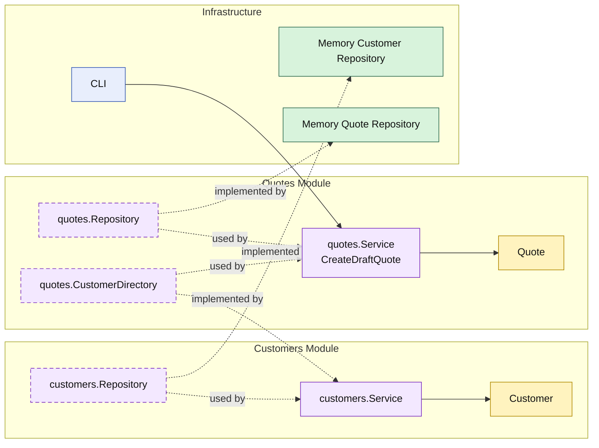

# Lesson 001: Modular Monolith Skeleton

## Objective

Build the first runnable slice of the application in Modular Monolith Architecture and make business-module boundaries visible through a `customers` module and a `quotes` module.

## Theory

Modular Monolith Architecture keeps the system as one deployable, but it does not treat the codebase as one undifferentiated application layer.

The key idea is:

- split the monolith into strong business modules
- keep each module cohesive
- expose narrow APIs between modules

This solves a problem that can still remain after the Onion track:

- the core may be protected
- but internal business capabilities can still blur together

The modular monolith answer is to make capability boundaries explicit even before any distributed deployment exists.

The tradeoff is that you now have to design:

- what belongs to a module
- what is public between modules
- what must stay internal

## Why This Matters Here

For this repository, the first Modular Monolith lesson should make one thing unmistakable:

- `customers` owns customer state and customer checks
- `quotes` owns quote creation
- `quotes` does not reach into customer storage directly
- `quotes` depends on a narrow customer-check capability implemented by `customers`

That is the first meaningful difference from the Onion baseline.

## Diagram

Legend:

- yellow: domain type
- purple: module-owned service or contract
- green: data adapter
- blue: framework edge
- dashed border: contract
- dashed arrow: structural relationship such as `used by` or `implemented by`

## Implementation Focus

Implement one simple flow:

- create a draft quote

The code should show:

- a `customers` module that implements the customer-check capability
- a `quotes` module with draft quote creation
- in-memory repositories wired from the outside
- one CLI demo that exercises the module boundary

Do not add quote lines, approvals, or reporting yet.

## What To Verify

- the project compiles
- `go test ./...` passes
- the demo can create a draft quote
- the `quotes` module depends on the `customers` module API, not its storage
