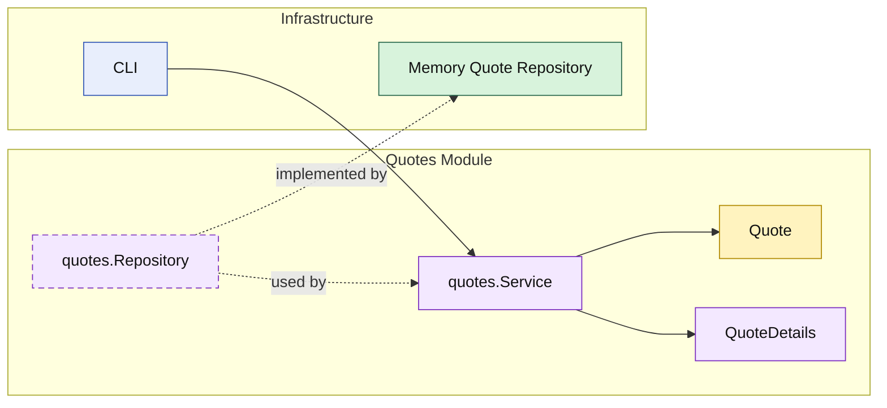

# Lesson 002: Quote Query Through Module API

## Objective

Add the first read flow to the Modular Monolith track and keep the module boundary visible during queries.

## Theory

The first lesson proved that `quotes` could create a draft quote while depending only on a narrow capability from `customers`.

The next question is:

- how should reads happen without letting callers treat repositories as the public API of a module?

In a modular monolith, repositories are usually internal implementation details of a module.

The public surface should be:

- the module service
- or another narrow module-owned query API

That way, other parts of the monolith still depend on:

- the business capability

not on:

- storage details inside the module

## Why This Matters Here

If the CLI or a future HTTP entrypoint reads the quote repository directly, then the `quotes` module stops being a real boundary and becomes just a folder around storage.

Adding a query through the module API keeps the lesson consistent:

- the `quotes` module owns quote reads
- the repository stays internal to that module
- callers depend on the module, not on repository internals

## Diagram

Legend:

- yellow: domain type
- purple: module-owned service or contract
- green: data adapter
- blue: framework edge
- dashed border: contract
- dashed arrow: structural relationship such as `used by` or `implemented by`

## Implementation Focus

Implement one simple read use case:

- get quote by id

The code should show:

- a quote query through the `quotes` module service
- a repository contract still internal to the module
- a query result model owned by the module
- a demo that creates a quote and then loads it again through the module API

## What To Verify

- `go test ./...` passes
- the demo can create a quote and then load it again
- the CLI depends on the `quotes` module service, not directly on the repository
