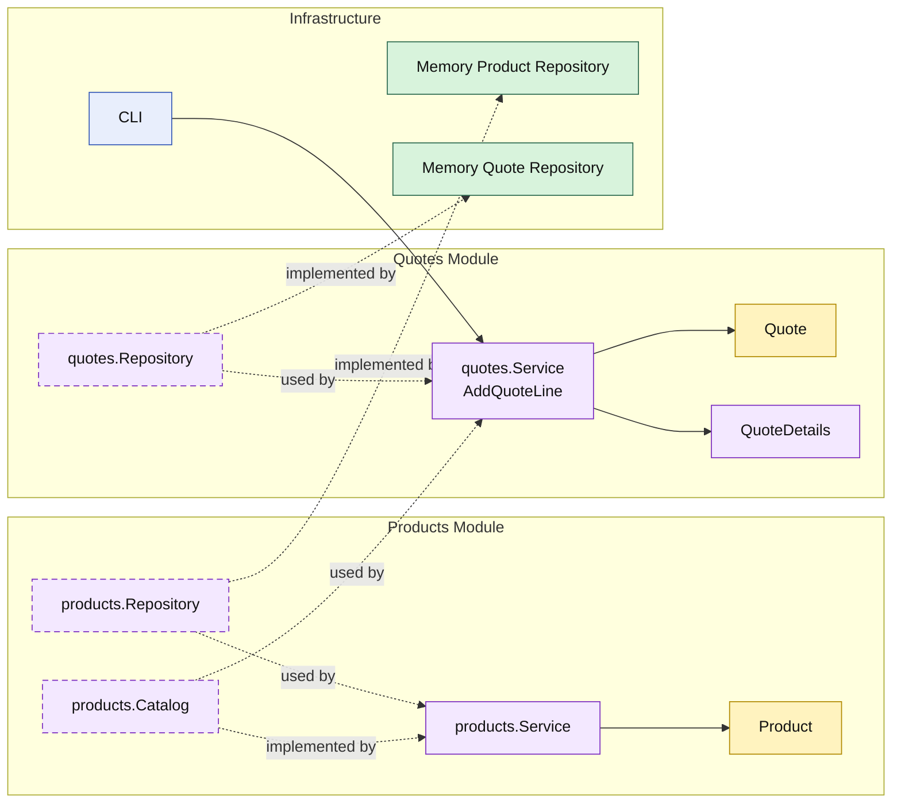

# Lesson 003: Add Quote Line With Product Module

## Objective

Add the first cross-module update flow so `quotes` can mutate an existing quote while depending on the public catalog capability of the `products` module.

## Theory

The first Modular Monolith lessons established:

- a `customers` module
- a `quotes` module
- module-owned read and write flows through the `quotes` service

The next useful step is to update an existing business object while depending on another business module.

That matters because Modular Monolith Architecture is not only about grouping code by folder.

It is also about making module interaction explicit:

- `quotes` should not own product data
- `products` should not own quote mutation
- the module boundary should stay visible while the workflow grows

In this lesson:

- `quotes` loads the quote it owns
- `quotes` asks the `products` module for a sellable product snapshot
- the `Quote` entity applies the line addition
- the updated quote is saved through the `quotes` repository

## Why This Matters Here

Without this step, the Modular Monolith track still only shows create and read.

Adding a quote line makes the module boundaries more meaningful:

- `products` owns product lookup
- `quotes` owns quote mutation
- the caller still talks to module services rather than repositories

That is the first point where the modular design starts to feel different from just “a monolith with packages.”

## Diagram

Legend:

- yellow: domain type
- purple: module-owned service or contract
- green: data adapter
- blue: framework edge
- dashed border: contract
- dashed arrow: structural relationship such as `used by` or `implemented by`

## Implementation Focus

Implement one update use case:

- add quote line

The code should show:

- a `products` module with a catalog API
- quote line behavior on the `Quote` entity
- the `quotes` service coordinating quote storage and product lookup
- an updated quote query that now includes line count

## What To Verify

- `go test ./...` passes
- the demo can create a quote, add a line, and load it again
- `quotes` depends on the `products` module API, not its repository
