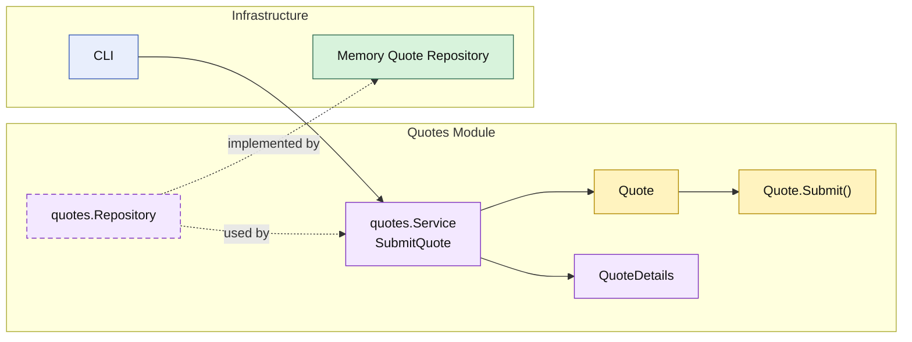

# Lesson 004: Submit Quote State Transition

## Objective

Move the first lifecycle rule into the `quotes` module by making quote submission an explicit state transition on the `Quote` entity.

## Theory

The previous Modular Monolith lessons showed:

- create a quote through the `quotes` module
- read a quote through the `quotes` module
- add lines while depending on the `products` module

But the quote was still mostly a mutable container with a status field.

Modular Monolith becomes more meaningful when a module not only owns data access, but also owns real lifecycle rules.

In this lesson:

- the `quotes` module still loads and saves the quote
- the `Quote` entity decides whether submission is valid
- other parts of the monolith still call the module service instead of reaching into the repository

That keeps the lifecycle rule inside the `quotes` module boundary instead of scattering it across callers.

## Why This Matters Here

If the CLI or some future `orders` module decides by itself whether a quote can be submitted, then the `quotes` module is still too thin.

Putting submission on the entity makes the module boundary stronger:

- only draft quotes can be submitted
- empty quotes cannot be submitted
- once submitted, the quote is no longer editable

Those are module-owned business rules, not storage rules and not caller rules.

## Diagram

Legend:

- yellow: domain type
- purple: module-owned service or contract
- green: data adapter
- blue: framework edge
- dashed border: contract
- dashed arrow: structural relationship such as `used by` or `implemented by`

## Implementation Focus

Implement one lifecycle use case:

- submit quote

The code should show:

- submission rules on the `Quote` entity
- a module service that loads, submits, and saves
- the existing add-line flow now respecting the submitted state
- the demo creating a quote, adding a line, submitting it, and loading it again

## What To Verify

- `go test ./...` passes
- a quote with lines can be submitted
- an empty quote cannot be submitted
- a submitted quote can no longer be edited
