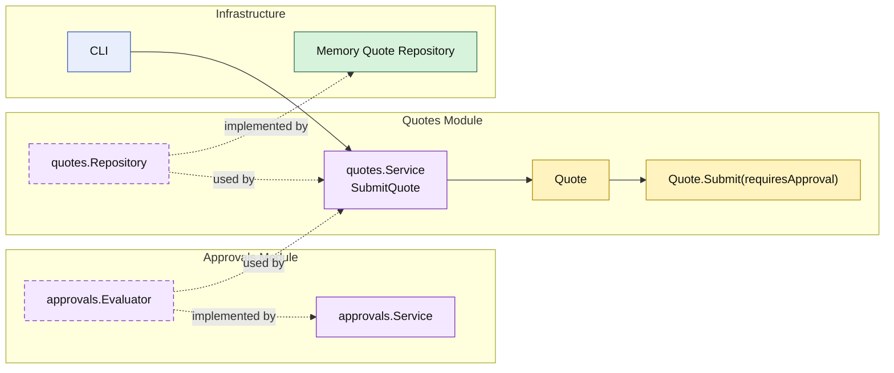

# Lesson 005: Approval Policy Module

## Objective

Introduce the first external business-policy seam in the Modular Monolith track by making quote submission depend on an `approvals` module capability.

## Theory

The previous lesson moved submission into the `Quote` entity.

That solved one problem:

- lifecycle rules no longer lived in the caller

But another problem remains:

- some submission outcomes depend on business policy that may change more often than the core lifecycle rule

In a modular monolith, that is a good place for another business module:

- `quotes` still owns quote lifecycle
- `approvals` owns approval-decision policy
- `quotes` depends on a narrow approval capability instead of hard-coding policy rules

This keeps two concerns separate:

- the entity owns how submission changes state
- the approval module decides which submission path applies

## Why This Matters Here

If the `Quote` entity hard-codes category-specific approval rules immediately, the `quotes` module becomes too coupled to one policy variant.

If the caller hard-codes the whole decision, the `quotes` module becomes too weak again.

The modular-monolith answer is:

- keep the transition in `quotes`
- keep the changing approval rule in `approvals`
- connect them through a narrow module API

## Diagram

Legend:

- yellow: domain type
- purple: module-owned service or contract
- green: data adapter
- blue: framework edge
- dashed border: contract
- dashed arrow: structural relationship such as `used by` or `implemented by`

## Implementation Focus

Implement one policy-aware workflow:

- submit quote with approval decision

The code should show:

- quote lines carrying enough information for approval evaluation
- an `approvals` module with a narrow evaluator API
- `quotes` submission ending in either `Approved` or `PendingApproval`

## What To Verify

- `go test ./...` passes
- standard quotes become `Approved`
- custom-build quotes become `PendingApproval`
- the submission transition still belongs to the `Quote` entity
