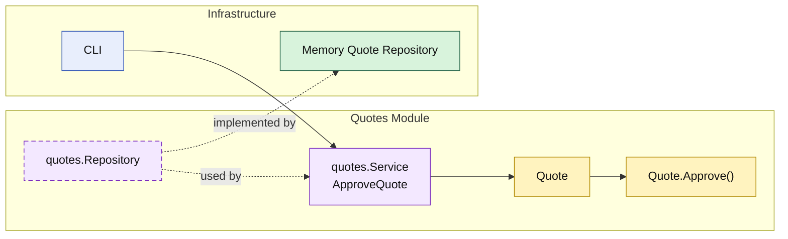

# Lesson 006: Approve Pending Quote

## Objective

Separate the approval decision from the approval action by adding an explicit `quotes` module workflow that moves a `PendingApproval` quote to `Approved`.

## Theory

Lesson `005` introduced the `approvals` module and used it to decide whether submission goes straight to `Approved` or stops at `PendingApproval`.

That still leaves one missing part:

- what actually performs the approval action?

In a modular monolith, the answer should stay consistent with the module boundary:

- the `approvals` module decides whether review is required
- the `quotes` module owns the quote lifecycle
- the `Quote` entity decides whether approval is valid
- the `quotes` service performs the approval use case

This keeps the concepts distinct:

- approval policy is not the same as approval action
- a pending state is not just a label
- lifecycle transitions still belong to the owning module

## Why This Matters Here

Without an explicit approval action, `PendingApproval` is only a status value, not a real workflow state.

Adding `Approve()` makes the state meaningful:

- draft quotes can be edited
- submitted quotes may stop at pending approval
- only pending quotes can be approved

That strengthens the `quotes` module as the owner of quote lifecycle rather than just the owner of quote persistence.

## Diagram

Legend:

- yellow: domain type
- purple: module-owned service or contract
- green: data adapter
- blue: framework edge
- dashed border: contract
- dashed arrow: structural relationship such as `used by` or `implemented by`

## Implementation Focus

Implement one new workflow step:

- approve pending quote

The code should show:

- an `Approve()` transition on the `Quote` entity
- a module service for quote approval
- tests for valid and invalid approval transitions
- a demo branch that submits a custom-build quote and then approves it

## What To Verify

- `go test ./...` passes
- pending quotes can be approved
- already approved quotes cannot be approved again
- the approval transition remains in the `quotes` module entity
