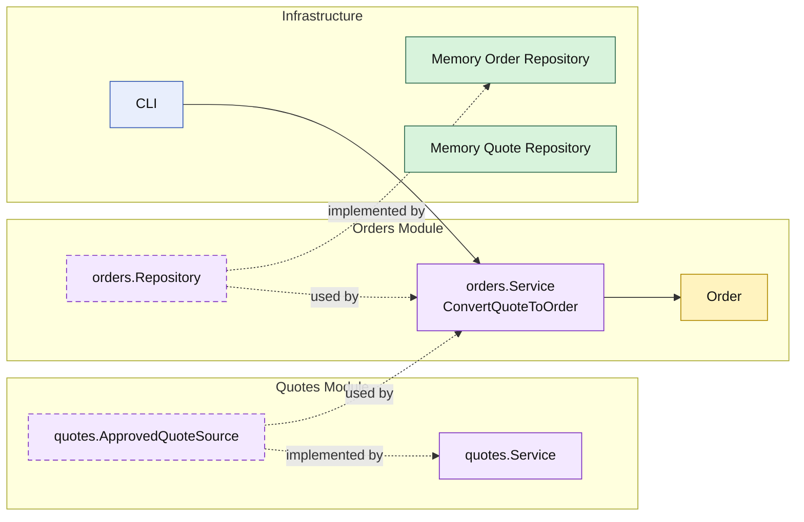

# Lesson 007: Convert Quote To Order

## Objective

Add the first cross-module workflow that turns an approved quote into an order owned by a new `orders` module.

## Theory

The Modular Monolith track now has a meaningful quote lifecycle:

- draft
- pending approval
- approved

The next step is to use an approved quote as input for another module.

This is an important modular-monolith lesson because it shows a different kind of module interaction:

- `quotes` still owns quote lifecycle
- `orders` owns order creation and order storage
- `orders` depends on a narrow quote-read capability instead of reaching into quote persistence directly

The business workflow crosses modules, but module ownership stays clear.

## Why This Matters Here

Without a cross-module workflow, the architecture still only proves that each module can manage its own local behavior.

Conversion makes the module boundaries more realistic:

- one approved business document becomes another
- the `orders` module coordinates the handoff
- the `quotes` module provides a stable, narrow API

That is the first point where the modular monolith starts to show why module APIs matter as much as internal design.

## Diagram

Legend:

- yellow: domain type
- purple: module-owned service or contract
- green: data adapter
- blue: framework edge
- dashed border: contract
- dashed arrow: structural relationship such as `used by` or `implemented by`

## Implementation Focus

Implement one workflow:

- convert approved quote to order

The code should show:

- a new `orders` module
- a narrow approved-quote API exposed by `quotes`
- an order created as a business snapshot from the approved quote
- the demo reaching conversion after approval

## What To Verify

- `go test ./...` passes
- approved quotes can be converted
- non-approved quotes cannot be converted
- the `orders` module depends on a `quotes` capability, not on quote storage
