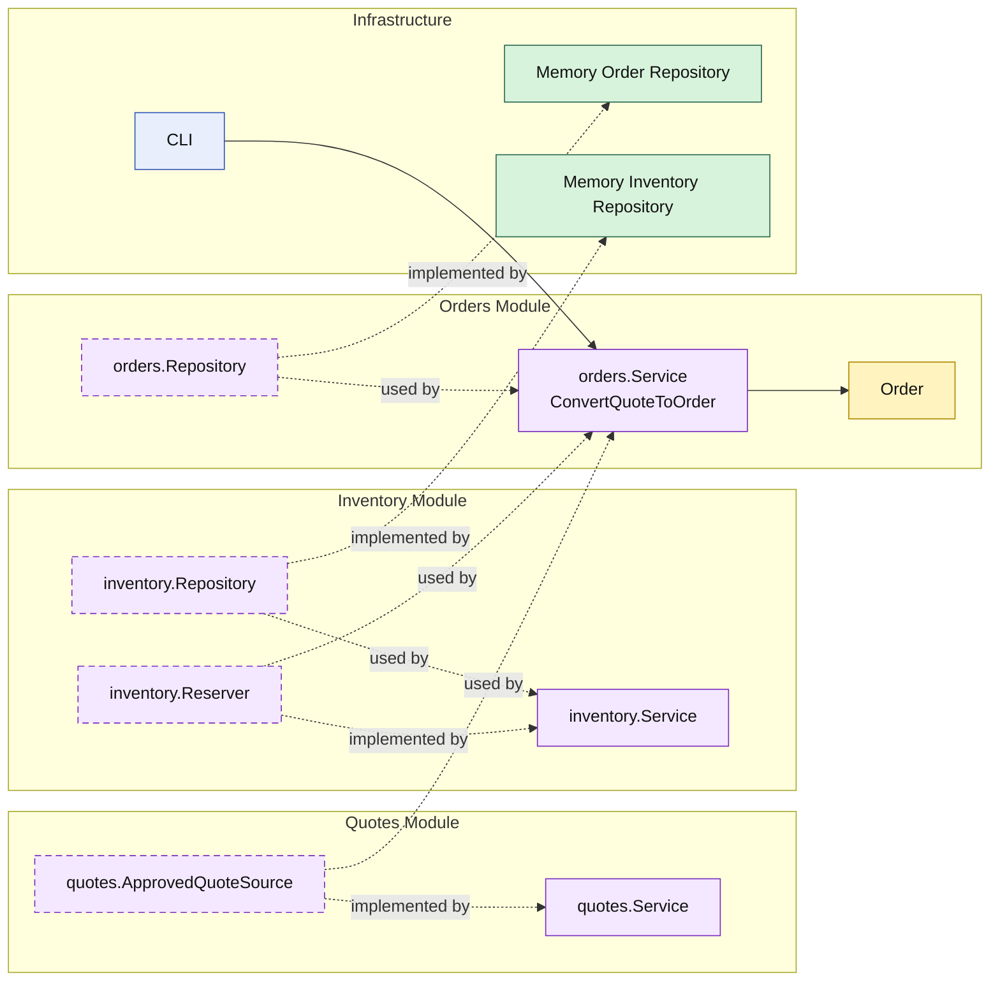

# Lesson 008: Order Conversion With Reservation

## Objective

Extend quote-to-order conversion so the `orders` module reserves stock through an `inventory` module before it saves the new order.

## Theory

Lesson `007` proved that one module can hand a business snapshot to another.

That is useful, but still incomplete for a real workflow.

Order creation usually has an operational consequence:

- stock must be reserved

In a modular monolith, the important question is not just _whether_ stock is reserved, but _through which module boundary_ that happens.

This lesson makes that explicit:

- `orders` still owns order creation
- `inventory` owns stock reservation rules and storage
- `orders` calls the public reservation capability of `inventory`

So the workflow crosses modules, but each module still owns its own business area.

## Why This Matters Here

Without this step, order conversion is only a document transformation.

Reservation makes the workflow operational:

- an approved quote becomes an order
- the order consumes inventory capacity
- failure in one module can stop a workflow in another

That is where modular boundaries start to matter more than simple code grouping.

## Diagram

Legend:

- yellow: domain type
- purple: module-owned service or contract
- green: data adapter
- blue: framework edge
- dashed border: contract
- dashed arrow: structural relationship such as `used by` or `implemented by`

## Implementation Focus

Implement one operational extension:

- reserve stock during quote-to-order conversion

The code should show:

- a new `inventory` module
- a reservation capability published by that module
- `orders` depending on the inventory module API instead of inventory storage
- conversion stopping if reservation fails

## What To Verify

- `go test ./...` passes
- approved quotes reserve stock before order save
- insufficient stock stops conversion
- `orders` depends on the `inventory` module API, not on memory storage
