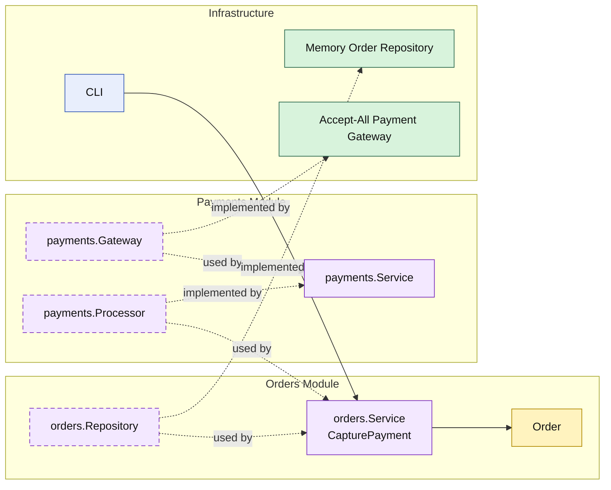

# Lesson 009: Payment Gateway And Order Capture

## Objective

Add payment capture after order creation, with the `orders` module depending on a `payments` module API instead of calling an external gateway directly.

## Theory

After lesson `008`, the `orders` module can:

- create an order from an approved quote
- reserve stock through `inventory`

The next forward step is payment capture.

In a modular monolith, the key design question is not only how to call a payment gateway.

It is how to stop the `orders` module from knowing too much about that integration.

This lesson keeps the boundary explicit:

- `orders` owns order lifecycle
- `payments` owns payment-processing capability
- infrastructure owns the concrete gateway adapter

So the order workflow continues across modules, but the external integration still stays behind a module API.

## Why This Matters Here

This is the first place where a business module depends on another module that exists mainly to protect an external service boundary.

That matters because it demonstrates a useful modular-monolith pattern:

- business workflow in one module
- integration capability in another
- technical adapter behind the capability module

That is different from simply putting a gateway interface in the same package as the order logic.

## Diagram

Legend:

- yellow: domain type
- purple: module-owned service or contract
- green: data adapter
- blue: framework edge
- dashed border: contract
- dashed arrow: structural relationship such as `used by` or `implemented by`

## Implementation Focus

Implement one new forward workflow step:

- capture payment for a pending-payment order

The code should show:

- a `payments` module API
- a concrete payment gateway adapter in infrastructure
- `orders` calling the `payments` module instead of the gateway directly
- order status changing from `PendingPayment` to `Paid`

## What To Verify

- `go test ./...` passes
- only pending-payment orders can be paid
- successful capture moves the order to `Paid`
- the payment adapter sits behind the `payments` module boundary
