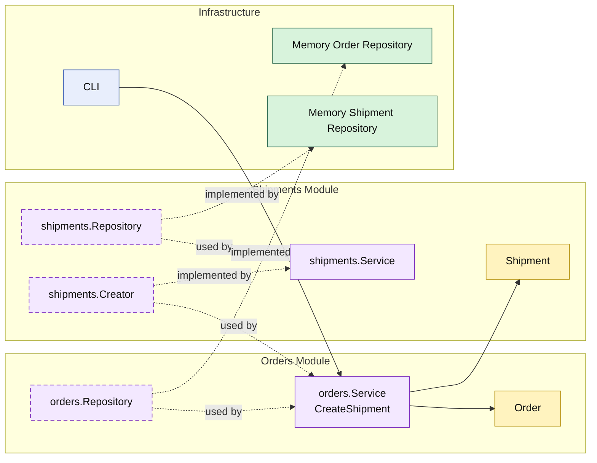

# Lesson 010: Shipment Creation After Payment

## Objective

Add shipment creation after payment, with the `orders` module depending on a `shipments` module API instead of owning shipment storage itself.

## Theory

After lesson `009`, the forward order workflow can:

- create an order
- reserve stock
- capture payment

The next narrow fulfillment step is shipment creation.

In a modular monolith, the important design question is whether shipment records become just another detail inside the `orders` module.

This lesson keeps the boundary explicit:

- `orders` still owns order lifecycle
- `shipments` owns shipment record creation and storage
- `orders` asks `shipments` to create a shipment, then advances the order to `Shipped`

That keeps fulfillment as a cross-module workflow instead of letting one module silently absorb everything.

## Why This Matters Here

The modular-monolith value becomes clearer when one business capability can move forward without collapsing neighboring capabilities into itself.

Shipment creation is a good example:

- the order must be payable before shipment
- the shipment record is a separate business artifact
- the shipment artifact should still have a clear owner

So this lesson shows that module boundaries can stay explicit even while the workflow remains linear.

## Diagram

Legend:

- yellow: domain type
- purple: module-owned service or contract
- green: data adapter
- blue: framework edge
- dashed border: contract
- dashed arrow: structural relationship such as `used by` or `implemented by`

## Implementation Focus

Implement one new forward workflow step:

- create a shipment for a paid order

The code should show:

- a new `shipments` module
- shipment storage owned by that module
- `orders` calling the `shipments` module API
- order status changing from `Paid` to `Shipped`

## What To Verify

- `go test ./...` passes
- only paid orders can be shipped
- successful shipment creates a shipment record and marks the order shipped
- shipment storage stays behind the `shipments` module boundary
