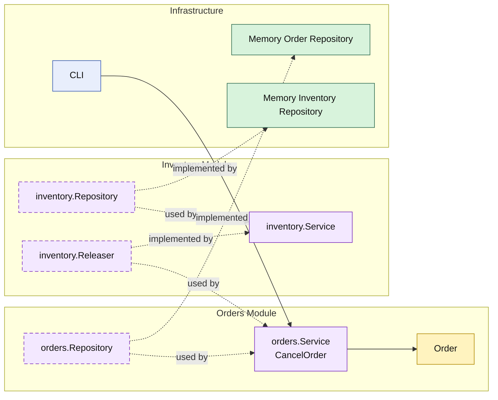

# Lesson 011: Order Cancellation And Release

## Objective

Add the first reverse order workflow: cancel an unshipped order and release its reserved stock through the `inventory` module.

## Theory

The forward path now reaches:

- order conversion
- inventory reservation
- payment capture
- shipment creation

But a realistic order module also needs a reverse path before shipment.

This lesson keeps that reversal modular:

- `orders` owns cancellation rules
- `inventory` owns stock release
- `orders` calls the `inventory` module API to undo the reservation

That means reversal is still a workflow across modules, not just a field change inside the order record.

## Why This Matters Here

Cancellation is the first place where the modular monolith has to prove it can unwind earlier cross-module work.

That matters because it shows:

- module boundaries still hold during reversal
- releasing stock is not secretly an order responsibility
- shipped orders can be blocked by order rules before the workflow reaches inventory

This is where modules start looking less like folders and more like coordinated business capabilities.

## Diagram

Legend:

- yellow: domain type
- purple: module-owned service or contract
- green: data adapter
- blue: framework edge
- dashed border: contract
- dashed arrow: structural relationship such as `used by` or `implemented by`

## Implementation Focus

Implement one reverse workflow step:

- cancel an unshipped order

The code should show:

- cancellation rules owned by the `orders` module
- release capability owned by the `inventory` module
- reserved stock being released only after the order passes cancellation rules
- shipped orders staying non-cancellable

## What To Verify

- `go test ./...` passes
- unshipped orders can be cancelled
- cancellation releases reserved stock
- shipped orders are rejected
