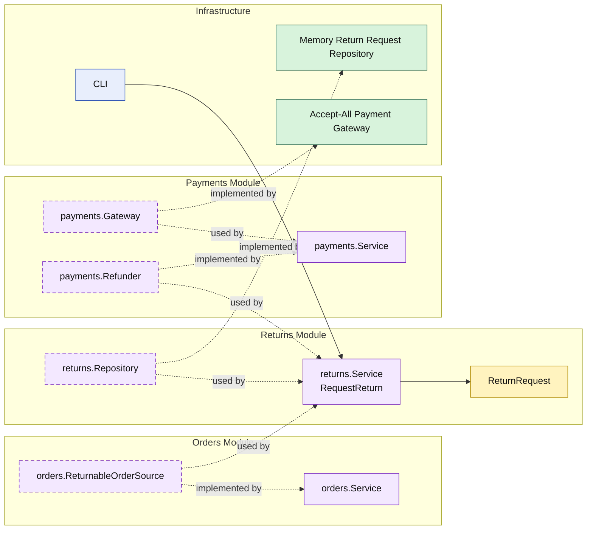

# Lesson 012: Return Request And Refund Boundary

## Objective

Add the first post-shipment reverse workflow by introducing a `returns` module that requests returns against shipped orders and triggers refunds through the `payments` module.

## Theory

Cancellation already covers the pre-shipment reversal path.

That is not enough for a realistic workflow because shipped orders need a different boundary:

- the order has already moved forward
- the stock reversal will come later
- the customer-facing reversal starts with a return request and refund

This lesson keeps that path modular:

- `orders` owns whether an order is returnable
- `returns` owns the return request record
- `payments` owns the refund capability

So return processing becomes a new cross-module workflow instead of being treated like delayed cancellation.

## Why This Matters Here

This is the first place where the modular monolith needs two different reversal concepts:

- cancel before shipment
- return after shipment

That distinction matters because it proves the modules are following business boundaries, not just technical reuse. A shipped order is no longer cancellable, but it can still participate in a different workflow owned by a different module.

## Diagram

Legend:

- yellow: domain type
- purple: module-owned service or contract
- green: data adapter
- blue: framework edge
- dashed border: contract
- dashed arrow: structural relationship such as `used by` or `implemented by`

## Implementation Focus

Implement one new post-shipment reverse workflow:

- request a return for a shipped order

The code should show:

- returnability still owned by the `orders` module
- return request storage owned by the `returns` module
- refund capability owned by the `payments` module
- shipped orders becoming returnable while non-shipped orders stay blocked

## What To Verify

- `go test ./...` passes
- only shipped orders can be returned
- successful return requests trigger a refund
- the return request is stored in the `returns` module
