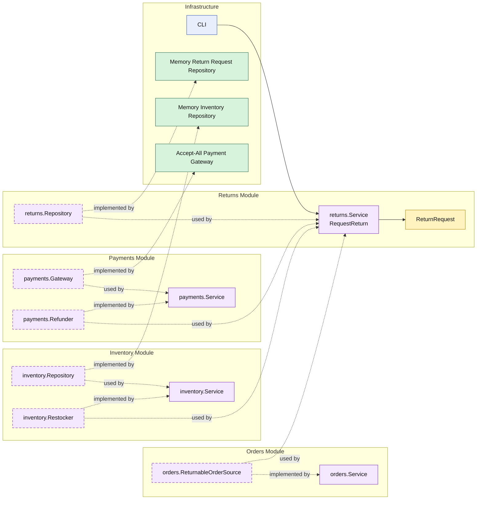

# Lesson 013: Return Restocking Boundary

## Objective

Extend the return workflow so refunded returns also restock inventory through a distinct inventory capability.

## Theory

Lesson `012` made returns a separate post-shipment workflow.

But it still only handled the customer-facing side:

- verify the order is returnable
- refund the payment
- store the return request

The stock-side reversal was still missing.

This lesson makes that explicit:

- `returns` still owns the return-request workflow
- `payments` still owns refund capability
- `inventory` now owns restocking capability

That matters because returns are not just reversed payments. They also change stock state, and that stock state should still belong to the inventory module.

## Why This Matters Here

This is the first post-shipment workflow that fans out into multiple collaborating modules:

- `orders` decides whether the order is eligible
- `payments` handles the money reversal
- `inventory` handles the stock reversal
- `returns` orchestrates and records the workflow

That is a more realistic modular-monolith example than a simple two-module call chain.

## Diagram

Legend:

- yellow: domain type
- purple: module-owned service or contract
- green: data adapter
- blue: framework edge
- dashed border: contract
- dashed arrow: structural relationship such as `used by` or `implemented by`

## Implementation Focus

Implement one missing stock-side reversal:

- restock inventory when a return is refunded

The code should show:

- restocking as a distinct inventory capability
- `returns` orchestrating refund and restock together
- return requests still being stored only by the `returns` module

## What To Verify

- `go test ./...` passes
- successful returns trigger both refund and restock
- restock failures stop the workflow
- the restock logic stays behind the `inventory` module boundary
