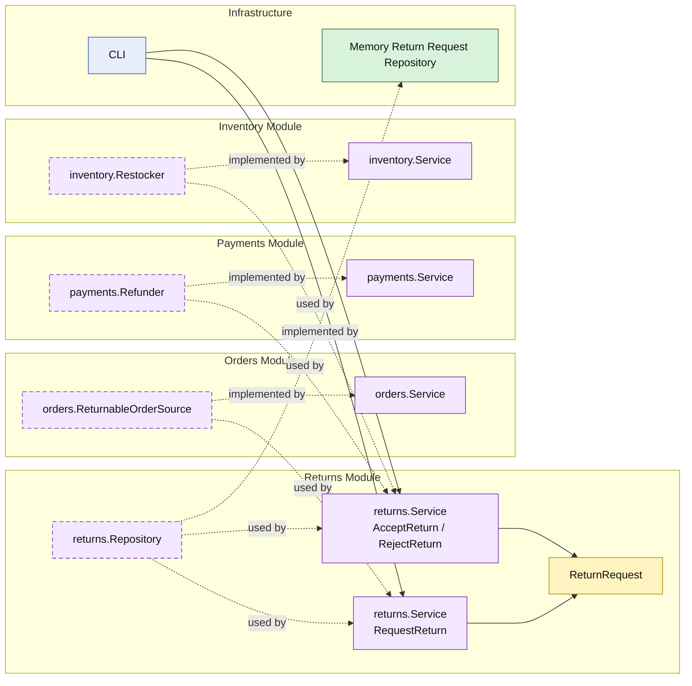

# Lesson 014: Return Review Boundary

## Objective

Insert an explicit review step into the return workflow so a return request is created first, and refund plus restock only happen when the request is accepted.

## Theory

Lesson `013` completed the full technical reversal for a return:

- verify the order is returnable
- refund payment
- restock inventory
- store the return request

That workflow works, but it still assumes every return should be accepted immediately.

This lesson separates two business decisions:

- creating a return request
- approving or rejecting that request

That keeps the modular-monolith boundaries clearer:

- `returns` owns the review workflow and state machine
- `payments` still owns refunds
- `inventory` still owns restocking

So review becomes a first-class business boundary, not just a future comment in the code.

## Why This Matters Here

This is the first lesson where the `returns` module starts to look like a real workflow owner instead of only an orchestration wrapper.

It now owns:

- a persistent return request
- a requested state
- an accepted path
- a rejected path

That is a better demonstration of modular design than immediately jumping from “request” to “refunded”.

## Diagram

Legend:

- yellow: domain type
- purple: module-owned service or contract
- green: data adapter
- blue: framework edge
- dashed border: contract
- dashed arrow: structural relationship such as `used by` or `implemented by`

## Implementation Focus

Implement one workflow split:

- requesting a return should not automatically refund and restock

The code should show:

- `Requested`, `Refunded`, and `Rejected` return states
- request creation separated from review actions
- refund and restock happening only on acceptance

## What To Verify

- `go test ./...` passes
- request creation only stores a requested return
- accepting a request triggers refund and restock
- rejecting a request does not trigger refund or restock
