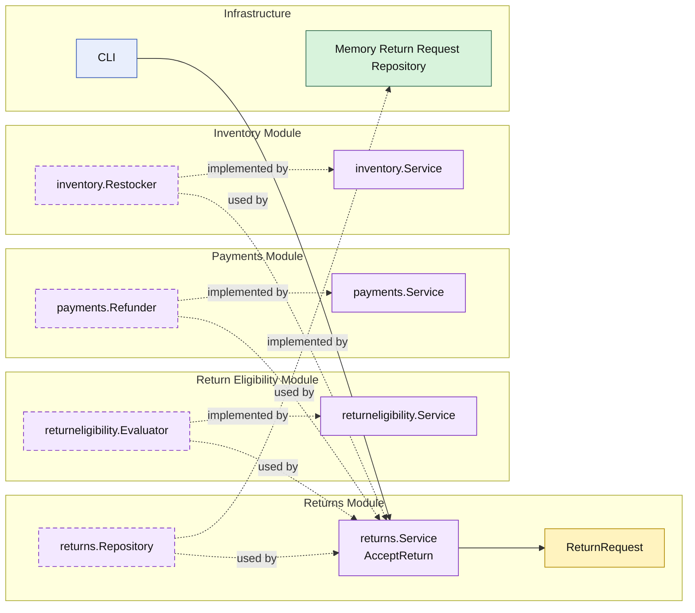

# Lesson 015: Return Eligibility Policy

## Objective

Make return acceptance policy-aware by moving the acceptance rule into a dedicated `returneligibility` module.

## Theory

Lesson `014` introduced a real review workflow for returns:

- request
- accept
- reject

But acceptance was still unconditional.

This lesson makes one more boundary explicit:

- `returns` owns the review workflow
- `returneligibility` owns the acceptance rule
- `payments` and `inventory` still own side effects after acceptance

That keeps policy separate from workflow orchestration.

## Why This Matters Here

Without a separate policy seam, the `returns` module would accumulate both:

- workflow state management
- business acceptance rules

That is manageable for one rule, but it gets muddy quickly as policy grows. A dedicated module keeps the rule replaceable and easier to reason about.

## Diagram

Legend:

- yellow: domain type
- purple: module-owned service or contract
- green: data adapter
- blue: framework edge
- dashed border: contract
- dashed arrow: structural relationship such as `used by` or `implemented by`

## Implementation Focus

Implement one policy seam:

- accepting a return should consult a separate eligibility capability

The code should show:

- a `returneligibility` module
- `returns` asking that module before refund and restock
- blocked returns becoming `Rejected` without side effects

## What To Verify

- `go test ./...` passes
- eligible returns still refund and restock
- policy-blocked returns are rejected
- blocked returns do not refund or restock
