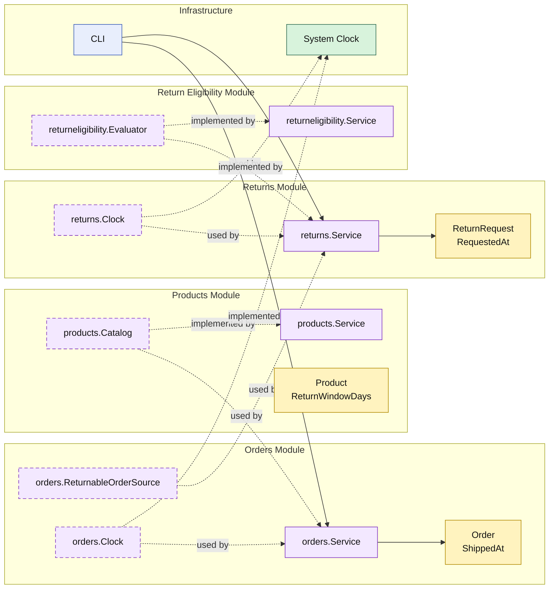

# Lesson 016: Real Return Window Policy

## Objective

Replace the placeholder return-eligibility rule with a real time-based return-window policy that uses shipped timestamps and per-product return-window snapshots.

## Theory

Lesson `015` separated policy from the return-review workflow.

But the policy itself was still only a placeholder:

- reject if reason is `outside return window`

That is not a real business rule.

This lesson turns it into one by threading the necessary data through the workflow:

- products define `ReturnWindowDays`
- quotes snapshot that value on each line
- orders carry the snapshot forward
- shipments stamp `ShippedAt`
- return requests stamp `RequestedAt`

That lets the `returneligibility` module evaluate an actual business window instead of reading a magic string.

## Why This Matters Here

This lesson is important because it shows a common modular-monolith pressure: a policy module often forces upstream modules to capture more truthful business data.

The policy did not become more realistic by changing one function alone. It required:

- richer product data
- richer order data
- a time source boundary
- a better return-request record

That is the kind of cross-module refinement that makes architectural tradeoffs visible.

## Diagram

Legend:

- yellow: domain type or business snapshot
- purple: module-owned service or contract
- green: adapter or technical implementation
- blue: framework edge
- dashed border: contract
- dashed arrow: structural relationship such as `used by` or `implemented by`

## Implementation Focus

Implement one real policy upgrade:

- return eligibility should depend on actual shipment and request timing

The code should show:

- `ReturnWindowDays` on products
- return-window snapshots carried from quote to order
- `ShippedAt` recorded when shipment is created
- `RequestedAt` recorded when the return is requested
- the `returneligibility` module evaluating those values

## What To Verify

- `go test ./...` passes
- in-window returns are allowed
- out-of-window returns are rejected
- the time source is abstracted behind a clock boundary
