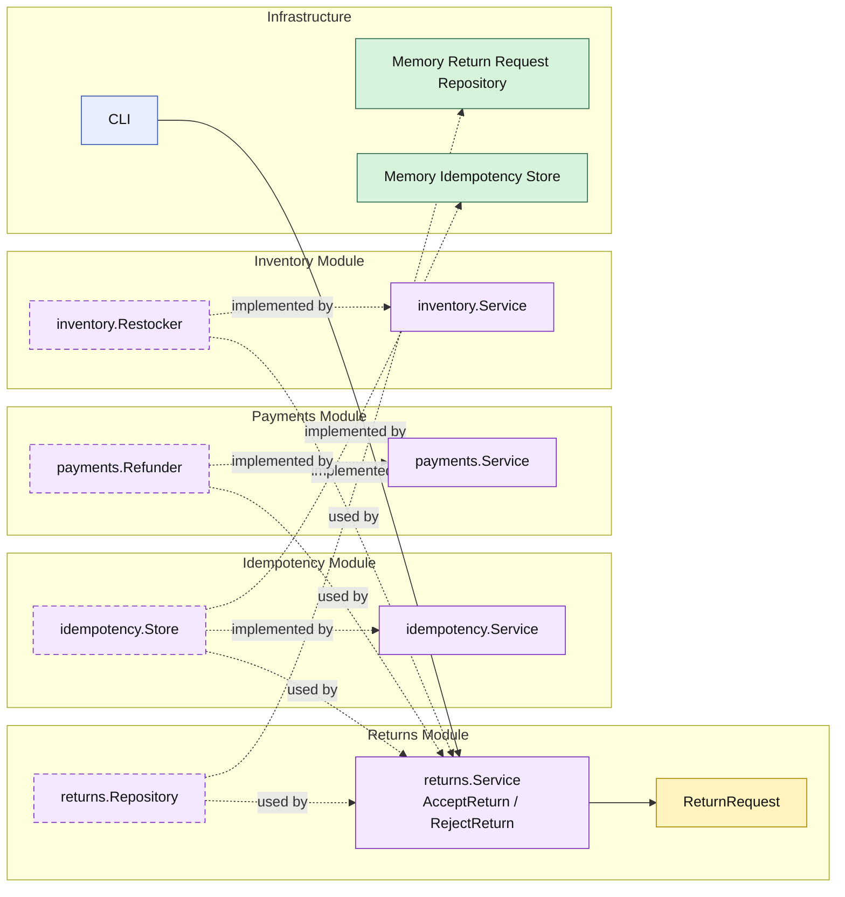

# Lesson 018: Return Command Idempotency

## Objective

Make return review commands retry-safe so duplicate accept and reject requests do not replay refund or restock side effects.

## Theory

The return workflow is now:

- requested
- reviewed
- policy-checked
- refunded and restocked on acceptance

That means `AcceptReturn` is no longer a harmless command to retry.

If the same command is sent twice after a timeout or retry, it could otherwise:

- refund twice
- restock twice
- produce inconsistent audit history

This lesson introduces a separate idempotency module so retry handling stays outside the return entity and outside the payment or inventory modules.

## Why This Matters Here

This is a good modular-monolith example because retry safety is a cross-cutting concern, but it still needs a clear home.

Putting idempotency directly inside:

- the payment module
- the inventory module
- or the return entity

would blur responsibilities.

A separate module lets the `returns` workflow ask one focused capability:

- has this command already succeeded?
- if so, return the stored result instead of replaying side effects

## Diagram

Legend:

- yellow: domain type or workflow record
- purple: module-owned service or contract
- green: adapter or technical implementation
- blue: framework edge
- dashed border: contract
- dashed arrow: structural relationship such as `used by` or `implemented by`

## Implementation Focus

Implement one retry-safety layer:

- accept and reject should be idempotent

The code should show:

- a separate `idempotency` module
- review commands carrying an idempotency key
- stored review results being returned on retries
- refunds and restocks not replaying when a result is already stored

## What To Verify

- `go test ./...` passes
- repeated accept commands reuse the stored result
- repeated reject commands reuse the stored result
- idempotent replays do not trigger refund or restock again
