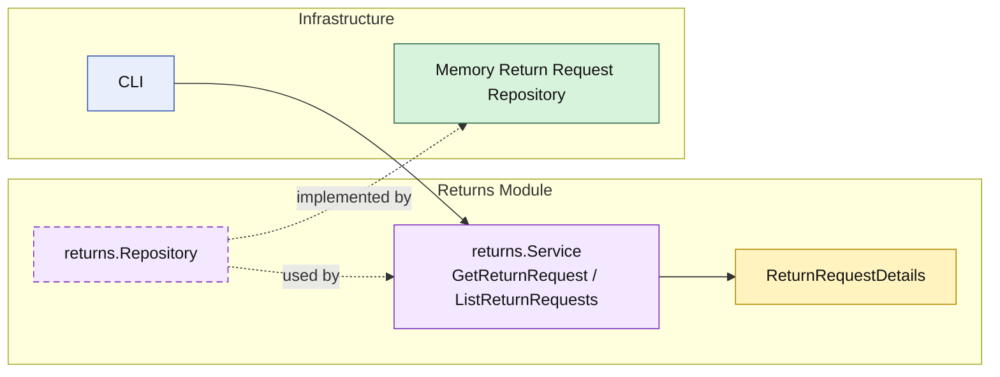

# Lesson 019: Return Query Surface

## Objective

Give the `returns` module an explicit read surface so callers load return requests through the module API instead of treating the repository as the public interface.

## Theory

The `returns` module already owns a meaningful workflow:

- request
- review
- policy check
- refund and restock
- actor metadata
- idempotent review commands

But without explicit queries, external callers still have an easy escape hatch:

- read the repository directly

That weakens the modular boundary because it makes the repository feel like the real API.

This lesson closes that gap:

- `returns` still owns persistence
- the module now publishes `GetReturnRequest`
- the module now publishes `ListReturnRequests`

So both write and read access go through the module surface.

## Why This Matters Here

In a modular monolith, module boundaries are not only about writes. If reads bypass the module, the architecture quietly drifts back toward shared storage with folders around it.

An explicit query surface keeps the lesson honest:

- the repository remains internal plumbing
- the module owns the read model it chooses to expose
- callers do not depend on storage details

## Diagram

Legend:

- yellow: query model or business-facing read shape
- purple: module-owned service or contract
- green: adapter or technical implementation
- blue: framework edge
- dashed border: contract
- dashed arrow: structural relationship such as `used by` or `implemented by`

## Implementation Focus

Implement one explicit read boundary:

- query return requests through the `returns` module

The code should show:

- `GetReturnRequest`
- `ListReturnRequests`
- repository support for list-by-status
- callers reading through the module service, not the repository directly

## What To Verify

- `go test ./...` passes
- a stored return request can be loaded through the module API
- return requests can be listed by status
- the demo can load and list returns without direct repository access
