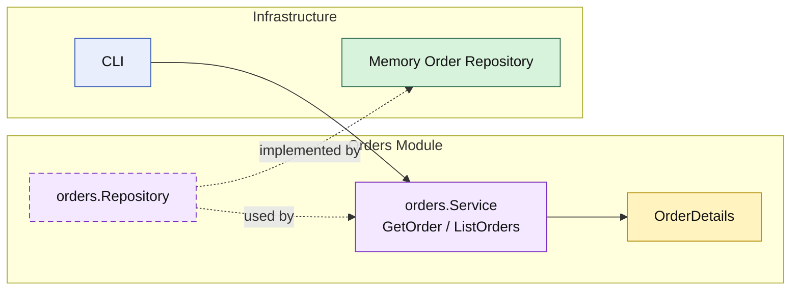

# Lesson 020: Order Query Surface

## Objective

Give the `orders` module an explicit read surface so callers load orders through the module API instead of treating the repository as the public interface.

## Theory

The `orders` module already owns a meaningful workflow:

- quote conversion
- inventory reservation
- payment capture
- shipment creation
- cancellation
- returnable-order lookup for the returns module

But that still leaves one common architectural shortcut:

- reading orders directly from storage

If that becomes normal, the repository starts to feel like the real public API and the module boundary weakens.

This lesson closes that gap:

- `orders` still owns persistence
- the module now publishes `GetOrder`
- the module now publishes `ListOrders`

So both write and read access go through the module surface.

## Why This Matters Here

Modular monolith boundaries should stay visible on the read side too.

Without that, the system drifts toward this pattern:

- module services for commands
- repositories for queries

That split quietly turns repositories into shared access points. An explicit query surface keeps the boundary honest:

- the repository remains internal plumbing
- the module owns the read shape it exposes
- callers depend on the module API instead of storage details

## Diagram

Legend:

- yellow: query model or business-facing read shape
- purple: module-owned service or contract
- green: adapter or technical implementation
- blue: framework edge
- dashed border: contract
- dashed arrow: structural relationship such as `used by` or `implemented by`

## Implementation Focus

Implement one explicit read boundary:

- query orders through the `orders` module

The code should show:

- `GetOrder`
- `ListOrders`
- repository support for list-by-status
- callers reading through the module service, not the repository directly

## What To Verify

- `go test ./...` passes
- a stored order can be loaded through the module API
- orders can be listed by status
- the demo can load and list orders without direct repository access
