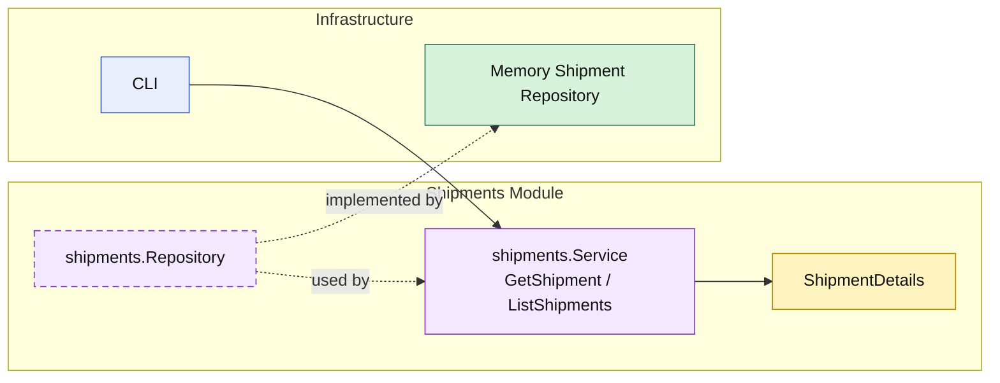

# Lesson 021: Shipment Query Surface

## Objective

Give the `shipments` module an explicit read surface so callers load shipments through the module API instead of treating the repository as the public interface.

## Theory

The `shipments` module already owns creation:

- receive a shipment request
- build a shipment record
- persist it

But without explicit queries, outside code still has an easy shortcut:

- read shipment storage directly

That weakens the modular boundary because the repository starts to look like the real public API.

This lesson closes that gap:

- `shipments` still owns persistence
- the module now publishes `GetShipment`
- the module now publishes `ListShipments`

So both write and read access go through the module surface.

## Why This Matters Here

In a modular monolith, even small modules should own their public read shape.

If callers create through the module but read through storage, the architecture quietly drifts toward:

- command methods on services
- queries on repositories

That makes repositories shared access points again. An explicit query surface keeps the module boundary visible:

- the repository remains internal plumbing
- the module owns the read model it exposes
- callers depend on shipment capabilities, not storage details

## Diagram

Legend:

- yellow: query model or business-facing read shape
- purple: module-owned service or contract
- green: adapter or technical implementation
- blue: framework edge
- dashed border: contract
- dashed arrow: structural relationship such as `used by` or `implemented by`

## Implementation Focus

Implement one explicit read boundary:

- query shipments through the `shipments` module

The code should show:

- `GetShipment`
- `ListShipments`
- repository support for list-by-order-id
- callers reading through the module service, not the repository directly

## What To Verify

- `go test ./...` passes
- a stored shipment can be loaded through the module API
- shipments can be listed for an order
- the demo can load and list shipments without direct repository access
