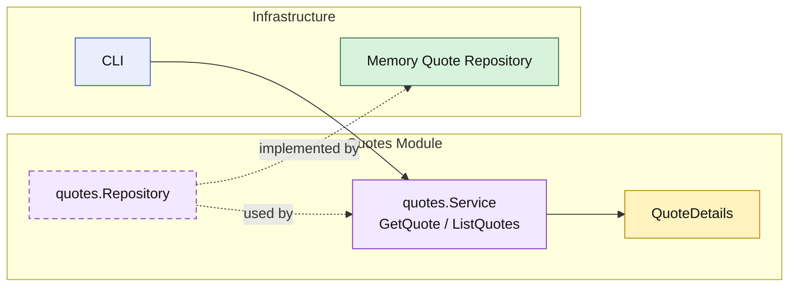

# Lesson 022: Quote List Query Surface

## Objective

Round out the `quotes` read side by adding list support through the module API instead of treating the repository as the public interface.

## Theory

The `quotes` module already publishes a single-item read:

- `GetQuote`

That was enough to prove the boundary on a simple lookup, but it still left an asymmetry:

- single quote reads through the module
- multi-quote reads would still tempt callers to reach for storage directly

This lesson closes that gap:

- `quotes` still owns persistence
- the module now publishes `ListQuotes`
- repository access stays internal to the module

So the quote read side is now complete at this level:

- get one quote
- list quotes by status

## Why This Matters Here

In a modular monolith, once list queries bypass the module, repositories quickly become the practical API again.

That weakens the architectural story because the system drifts toward:

- module services for writes
- repositories for reporting and browsing

Adding `ListQuotes` keeps the boundary consistent:

- the repository remains internal plumbing
- the `quotes` module owns the read shape it exposes
- callers depend on quote capabilities, not on storage internals

## Diagram

Legend:

- yellow: query model or business-facing read shape
- purple: module-owned service or contract
- green: adapter or technical implementation
- blue: framework edge
- dashed border: contract
- dashed arrow: structural relationship such as `used by` or `implemented by`

## Implementation Focus

Implement one explicit list boundary:

- query quotes through the `quotes` module

The code should show:

- `GetQuote`
- `ListQuotes`
- repository support for list-by-status
- callers reading through the module service, not the repository directly

## What To Verify

- `go test ./...` passes
- quotes can be listed by status through the module API
- the demo can load one quote and list approved quotes without direct repository access
