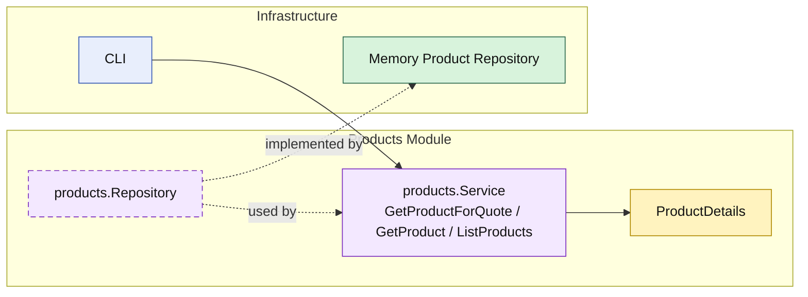

# Lesson 023: Product Query Surface

## Objective

Promote the `products` module from a supporting quote dependency into an explicit read surface with product queries through the module boundary.

## Theory

The `products` module already exposes one narrow capability:

- `GetProductForQuote`

That is useful for the `quotes` workflow, but it is not the same as saying the module has a real public read API for product browsing or lookup.

This lesson adds that missing surface:

- `products` still supports quote pricing and category lookup
- the module now publishes `GetProduct`
- the module now publishes `ListProducts`

So the module has:

- one specialized capability for quote creation
- one general read surface for product access

## Why This Matters Here

Without explicit product queries, the product module remains a helper instead of a visible business boundary.

That encourages a common drift:

- quote workflows use the product module
- everything else reads product storage directly

Adding product queries keeps the architecture consistent:

- the repository remains internal plumbing
- the `products` module owns the read shapes it exposes
- callers depend on product capabilities, not storage details

## Diagram

Legend:

- yellow: query model or business-facing read shape
- purple: module-owned service or contract
- green: adapter or technical implementation
- blue: framework edge
- dashed border: contract
- dashed arrow: structural relationship such as `used by` or `implemented by`

## Implementation Focus

Implement one explicit read surface:

- query products through the `products` module

The code should show:

- `GetProduct`
- `ListProducts`
- repository support for category and active filtering
- existing quote-support behavior still available through `GetProductForQuote`

## What To Verify

- `go test ./...` passes
- a stored product can be loaded through the module API
- products can be listed by category and activity through the module API
- the demo can load and list products without direct repository access
