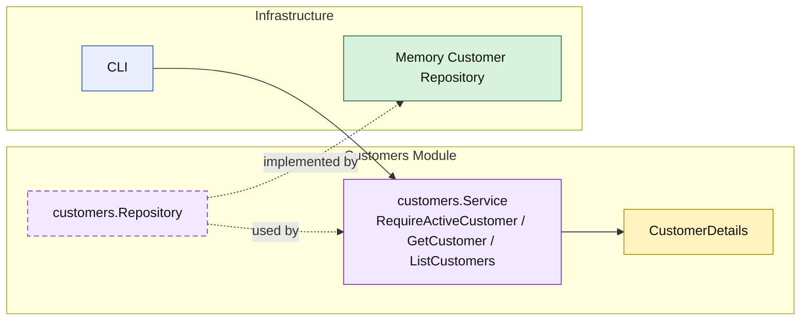

# Lesson 024: Customer Query Surface

## Objective

Promote the `customers` module from a supporting validation dependency into an explicit read surface with customer queries through the module boundary.

## Theory

The `customers` module already exposes one narrow capability:

- `RequireActiveCustomer`

That is useful for quote creation, but it does not yet make the module a visible public read boundary for customer lookup or browsing.

This lesson adds that missing surface:

- `customers` still supports active-customer validation
- the module now publishes `GetCustomer`
- the module now publishes `ListCustomers`

So the module has:

- one specialized capability for validation
- one general read surface for customer access

## Why This Matters Here

Without explicit customer queries, the customer module stays a helper and storage becomes the natural place to read customers from.

That weakens the modular-monolith story because the system drifts toward:

- module services for workflow checks
- repositories for ordinary reads

Adding customer queries keeps the boundary consistent:

- the repository remains internal plumbing
- the `customers` module owns the read shapes it exposes
- callers depend on customer capabilities, not storage details

## Diagram

Legend:

- yellow: query model or business-facing read shape
- purple: module-owned service or contract
- green: adapter or technical implementation
- blue: framework edge
- dashed border: contract
- dashed arrow: structural relationship such as `used by` or `implemented by`

## Implementation Focus

Implement one explicit read surface:

- query customers through the `customers` module

The code should show:

- `GetCustomer`
- `ListCustomers`
- repository support for active filtering
- existing validation behavior still available through `RequireActiveCustomer`

## What To Verify

- `go test ./...` passes
- a stored customer can be loaded through the module API
- customers can be listed with active-only filtering through the module API
- the demo can load and list customers without direct repository access
