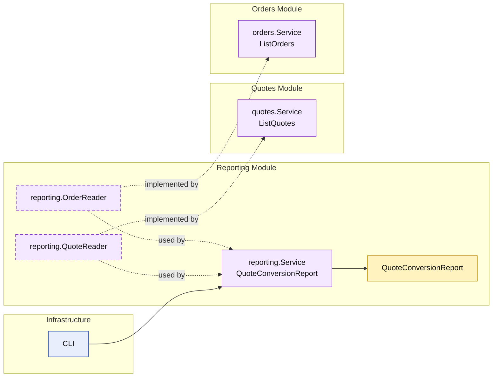

# Lesson 025: Quote Conversion Report

## Objective

Introduce the first projection-style report in the Modular Monolith track and make it explicit that cross-module reporting should still depend on module APIs, not on shared storage access.

## Theory

Up to this point, the modular monolith read side has focused on:

- get one thing
- list a group of things

Reports are different.

A report often does not belong to one entity or one module record.

Instead, it:

- reads from multiple module APIs
- combines or aggregates those results
- produces a report model with its own meaning

This lesson uses a simple quote conversion report:

- total quotes
- approved quotes
- converted quotes
- conversion rate

The important architectural point is that the report still does not read repositories directly. It depends on the `quotes` and `orders` module query surfaces.

## Why This Matters Here

Cross-module reporting is one of the easiest places for a modular monolith to lose discipline.

Without a clear home, teams often jump straight to:

- direct repository reads
- shared SQL-shaped reporting code
- infrastructure-driven joins that bypass module boundaries

This lesson keeps the design honest:

- reporting is a module of its own
- it depends on published read capabilities from other modules
- repositories remain internal to their owning modules

## Diagram

Legend:

- yellow: report model or business-facing read shape
- purple: module-owned service or contract
- blue: framework edge
- dashed border: contract
- dashed arrow: structural relationship such as `used by` or `implemented by`

## Implementation Focus

Implement one cross-module report:

- `QuoteConversionReport`

The code should show:

- a dedicated reporting module
- dependency on `quotes` and `orders` query APIs
- aggregation logic owned by the reporting module
- no direct repository access from the report

## What To Verify

- `go test ./...` passes
- the report combines quote and order counts correctly
- the demo can render the report output
