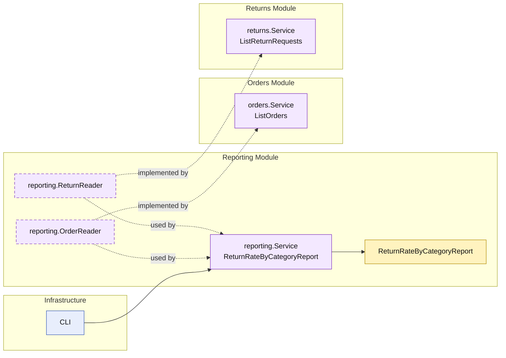

# Lesson 026: Return Rate By Category Report

## Objective

Add a second projection-style report that combines shipped orders and refunded returns into a category-based business metric without bypassing module boundaries.

## Theory

The first report lesson showed that cross-module reporting can still live behind a dedicated module API.

This lesson extends that idea with a more analytics-style question:

- how many units were shipped per category
- how many units were later refunded per category
- what is the resulting return rate

No single module owns that metric by itself.

The report depends on:

- `orders` for shipped quantities
- `returns` for refunded quantities

The important architectural point is that the reporting module still reads through published module query APIs. It does not reach into repositories directly.

## Why This Matters Here

Category-rate metrics are the kind of thing that often pushes teams to bypass module boundaries in a modular monolith.

The usual temptation is:

- read tables directly
- join data in infrastructure code
- let reporting quietly escape the modular design

This lesson keeps the architecture honest:

- reporting remains a module of its own
- line-level read shapes come from the owning modules
- the aggregation logic stays inside the reporting module

## Diagram

Legend:

- yellow: report model or business-facing read shape
- purple: module-owned service or contract
- blue: framework edge
- dashed border: contract
- dashed arrow: structural relationship such as `used by` or `implemented by`

## Implementation Focus

Implement one cross-module report:

- `ReturnRateByCategoryReport`

The code should show:

- a dedicated reporting-module use case
- line-level read shapes coming from `orders` and `returns`
- category aggregation owned by the reporting module
- no direct repository access from the report

## What To Verify

- `go test ./...` passes
- shipped and refunded quantities are grouped by category correctly
- the demo can render the report output
