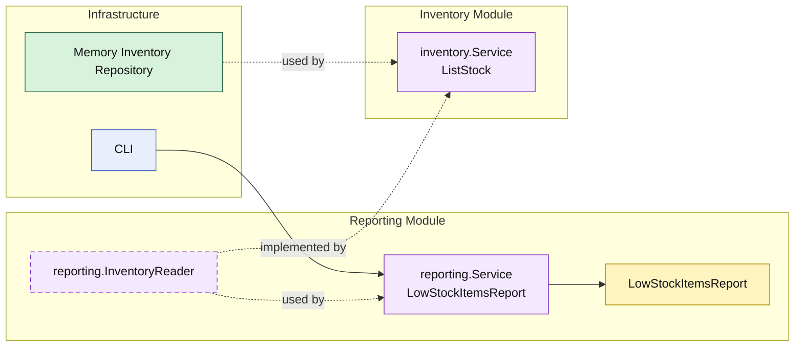

# Lesson 027: Low Stock Items Report

## Objective

Add an operational inventory report and introduce a narrow stock read seam without turning the inventory module into a full query track yet.

## Theory

So far, the `inventory` module has only appeared as a command-side collaborator:

- reserve stock
- release stock
- restock returned items

That is enough for workflow behavior, but it does not yet expose stock as readable business information.

This lesson adds a small but important idea:

- some reports need a read seam into a supporting module
- that does not mean the module must immediately grow a full query family

The report answers:

- which items are at or below a given threshold

The inventory module contributes:

- stock snapshots

The reporting module owns:

- the threshold rule
- the low-stock projection
- the report output shape

## Why This Matters Here

Operational reporting is another place where modular monoliths often lose discipline and go straight to storage.

This lesson keeps the design honest:

- inventory still owns stock data access
- reporting still owns the meaning of the low-stock report
- infrastructure does not decide what “low stock” means

## Diagram

Legend:

- yellow: report model or business-facing read shape
- purple: module-owned service or contract
- green: adapter or technical implementation
- blue: framework edge
- dashed border: contract
- dashed arrow: structural relationship such as `used by` or `implemented by`

## Implementation Focus

Implement one operational report:

- `LowStockItemsReport`

The code should show:

- a stock snapshot capability on the `inventory` module
- threshold filtering owned by the reporting module
- no direct repository access from the report

## What To Verify

- `go test ./...` passes
- items at or below the threshold are included
- the demo can render the low-stock output
