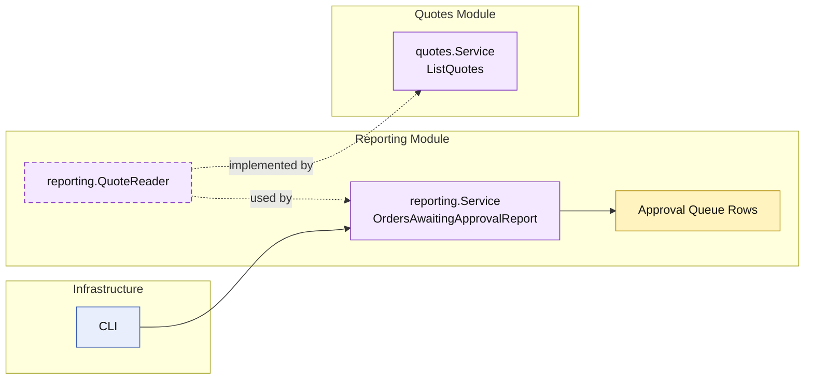

# Lesson 028: Orders Awaiting Approval Report

## Objective

Add an approval-queue style report that exposes pending approval work as a reporting-module projection.

## Theory

The name "orders awaiting approval" is slightly imperfect in this Modular Monolith track.

The current model does not have:

- a separate approval aggregate
- an order that exists before quote approval

What it does have is:

- quotes in `PendingApproval`

So the honest projection is:

- an approval queue over pending-approval quotes

This is still a useful lesson because operational reports do not need to mirror aggregate names mechanically. The reporting module can speak in the language of work queues while still being explicit about the underlying model it reads.

## Why This Matters Here

The reporting track already includes:

- conversion metrics
- return analysis
- operational stock visibility

This lesson adds a human workflow queue.

That broadens the reporting story without inventing domain structures the current model does not actually own.

## Diagram

Legend:

- yellow: report model or business-facing read shape
- purple: module-owned service or contract
- blue: framework edge
- dashed border: contract
- dashed arrow: structural relationship such as `used by` or `implemented by`

## Implementation Focus

Implement one queue-style report:

- `OrdersAwaitingApprovalReport`

The code should show:

- a reporting projection over `PendingApproval` quotes
- line count and total amount calculated through the quotes module read model
- no direct repository access from the report

## What To Verify

- `go test ./...` passes
- pending approval quotes appear in the queue
- line counts and total amounts are surfaced correctly
- the demo can render the approval queue output
