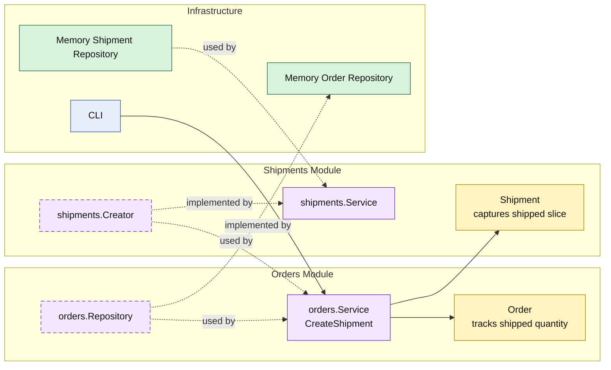

# Lesson 030: Partial Shipment Support

## Objective

Make fulfillment quantity-aware so an order can be shipped in multiple steps instead of only as an all-or-nothing transition.

## Theory

Up to this point, shipment creation has assumed a simple rule:

- once an order is payable, one shipment ships everything

That is useful early on, but too narrow for a realistic fulfillment workflow.

Real systems often need:

- a first shipment for currently available quantity
- later shipments for the remaining quantity

In this modular monolith, the important ownership split is:

- the `orders` module tracks shipped progress per line and owns fulfillment state
- the `shipments` module records the shipped slice
- the application service decides whether to ship explicit quantities or all remaining quantities

The key lifecycle change is the new intermediate state:

- `PartiallyShipped`

## Why This Matters Here

The payment review lesson added a branch before fulfillment.

This lesson adds incremental fulfillment inside fulfillment itself.

The shipping workflow is no longer a one-time state flip. It becomes progress over time, and that affects other application behavior too:

- cancellation must now reject partially shipped orders
- later shipment commands must continue from remaining quantity
- reporting should still treat partial fulfillment as real workflow progress

## Diagram

Legend:

- yellow: domain type or workflow record
- purple: module-owned service or contract
- green: data adapter
- blue: framework edge
- dashed border: contract
- dashed arrow: structural relationship such as `used by` or `implemented by`

## Implementation Focus

Implement one incremental fulfillment workflow:

- `PartiallyShipped` as an order state
- shipped quantity tracking on order lines
- explicit shipment line input for partial shipment
- default “ship all remaining” behavior for the existing full-shipment path

The code should show:

- the `orders` module updating shipment progress
- later shipments continuing from remaining quantity
- cancellation treating partial shipment as already fulfilled

## What To Verify

- `go test ./...` passes
- a partial shipment stores only the requested quantity
- a later shipment can ship the remaining quantity
- partially shipped orders cannot be cancelled
