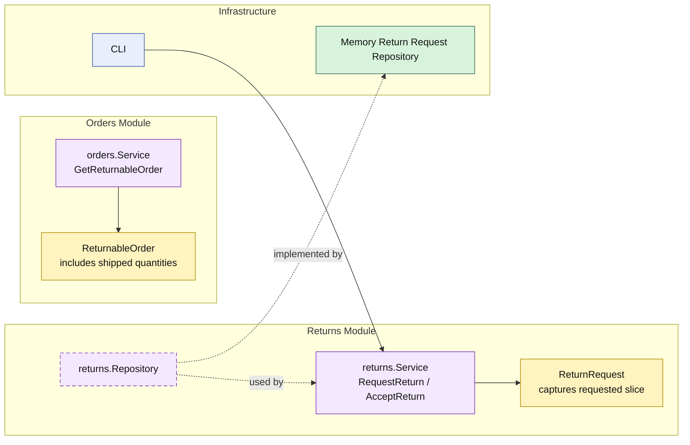

# Lesson 031: Partial Returns By Line

## Objective

Make returns quantity-aware so a return request can represent a specific returned slice instead of always meaning “the whole shipped order comes back.”

## Theory

Up to this point, the return workflow has assumed a simple rule:

- a return request snapshots everything that was shipped

That is useful early on, but too narrow for realistic reverse logistics.

Real systems often need:

- one returned unit from a multi-unit line
- selected lines from a larger shipment
- approval, refund, and restock only for the returned slice

In this modular monolith, the important ownership split is:

- the `orders` module exposes shipped quantities in its returnable-order API
- the `returns` module owns the explicit requested return lines
- refund, restock, and reporting use the actual requested slice rather than the full order

## Why This Matters Here

The partial-shipment lesson made fulfillment quantity-aware.

This lesson makes reverse fulfillment quantity-aware too.

That matters because:

- refund amount should match the returned quantity
- restock amount should match the returned quantity
- return-rate reporting should use the actual returned slice

Without this step, reverse workflow logic still stays coarser than forward workflow logic.

## Diagram

Legend:

- yellow: domain type or workflow record
- purple: module-owned service or contract
- green: data adapter
- blue: framework edge
- dashed border: contract
- dashed arrow: structural relationship such as `used by` or `implemented by`

## Implementation Focus

Implement one quantity-aware reverse workflow:

- explicit return line selection and quantity
- refund and restock based on the selected slice
- reporting using actual returned quantities

The code should show:

- request commands carrying return-line input
- `ReturnRequest` storing only the requested slice
- existing review and refund flow still working on that narrower model

## What To Verify

- `go test ./...` passes
- a return request can capture only part of a shipped line
- refund amount matches the returned quantity
- restock quantity matches the returned quantity
