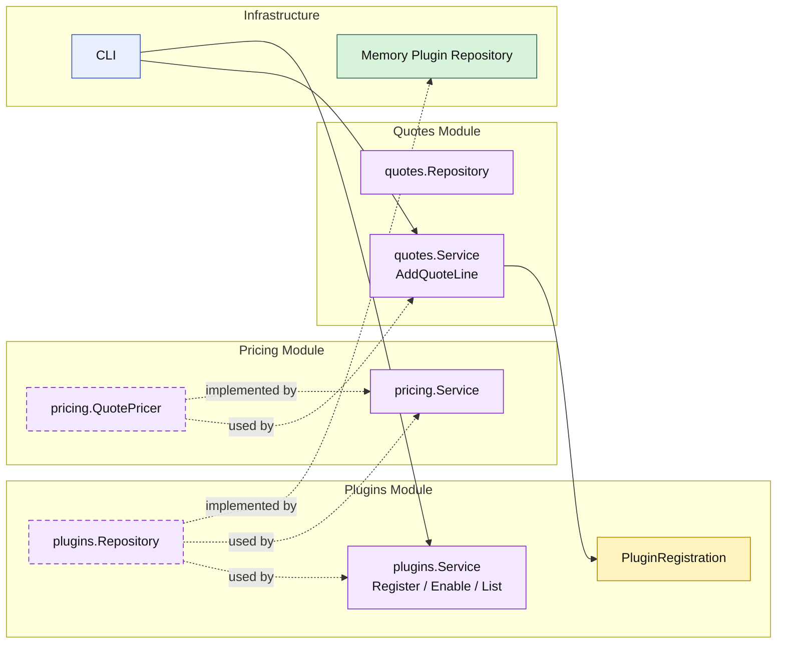

# Lesson 032: Plugin Pricing Extension Point

## Objective

Add a real extension seam so enabled plugins can change quote-line pricing without changing the `quotes` workflow structure.

## Theory

Up to now, quote pricing in the Modular Monolith track has just been the product's stored unit price.

That proves a simple workflow, but not extensibility.

This lesson adds a different architectural idea:

- the `quotes` module keeps its `AddQuoteLine` use case stable
- a `plugins` module owns registration, enablement, and listing
- a `pricing` module owns the pricing capability that `quotes` depends on

The extension stays deliberately narrow:

- quote-line unit price

The quote workflow does not change, but the effective unit price can change because the enabled plugin set changes.

## Why This Matters Here

A modular monolith is not only about workflow orchestration. It also needs disciplined places for optional behavior to grow.

Without this seam, every pricing experiment would push conditionals into:

- `quotes.Service`
- `Quote`
- or random infrastructure helpers

With it:

- the `quotes` module still owns quote editing
- the `plugins` module owns activation state
- the `pricing` module owns price calculation behavior

## Diagram

Legend:

- yellow: workflow record or domain-facing state
- purple: module-owned service or contract
- green: data adapter
- blue: framework edge
- dashed border: contract
- dashed arrow: structural relationship such as `used by` or `implemented by`

## Implementation Focus

Implement one extension seam:

- plugin registration, enable, and list services
- a pricing capability that `quotes` depends on
- one sample plugin: `seasonal-pricing`

The code should show:

- the quote use case stays structurally stable
- pricing changes only because the enabled plugin set changes
- plugin registration and activation are explicit module behavior

## What To Verify

- `go test ./...` passes
- a pricing plugin can be registered and enabled
- enabling `seasonal-pricing` changes the quote line unit price
- the demo can show plugin registration, activation, and pricing impact
