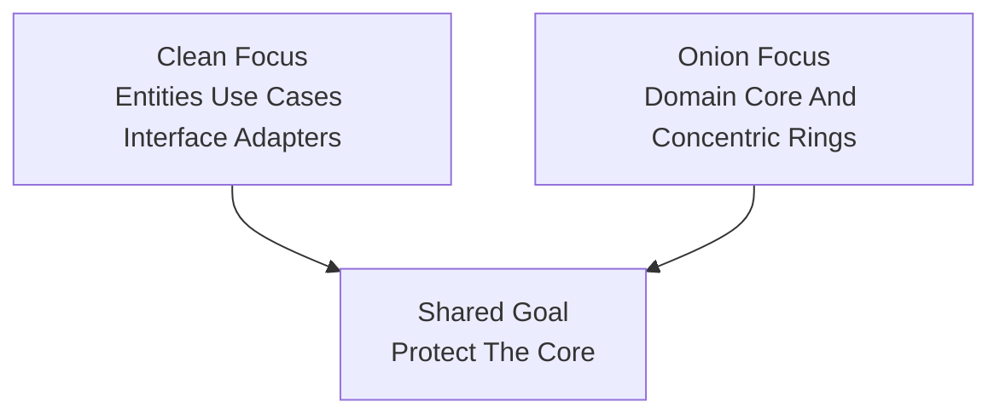

# Lesson 000: From Clean To Onion

## Objective

Explain how Onion Architecture relates to Clean Architecture, where they overlap, where they differ, and why it is still worth studying Onion after finishing the Clean track.

## Short Answer

Onion Architecture and Clean Architecture are extremely close relatives.

They both care deeply about:

- business logic at the center
- dependencies pointing inward
- infrastructure at the edge
- isolating the core from frameworks

So yes, part of the difference is semantic.

But it is not only semantic.

Clean Architecture mainly taught this repository to think in terms of:

- entities
- use cases
- interface adapters
- frameworks and drivers

Onion Architecture shifts the emphasis slightly.

It talks more directly about concentric rings around the domain core:

- domain model at the center
- application services around it
- infrastructure further out

The result can look similar in code, but the teaching focus changes.

## How They Are Related

Both architectures are trying to answer the same broad question:

"How do we stop business logic from being owned by frameworks, transport details, or persistence concerns?"

That means Onion should not feel like a reset after Clean.

It should feel like a close variation in the same architectural family.

Both styles want:

- rich business concepts away from frameworks
- testable application workflows
- replaceable infrastructure
- strong inward dependency direction

## Diagram

## What Is Different

The biggest difference is emphasis.

Clean Architecture gives stronger names to translation roles:

- controller
- presenter
- input boundary
- output boundary

Onion Architecture is often less interested in that exact vocabulary.

It tends to emphasize:

- the domain as the innermost core
- application services around the domain
- infrastructure depending on application and domain

That usually leads to a slightly different mental model:

- Clean asks you to notice the policy layers and translation seams
- Onion asks you to notice the rings around the domain and keep the core progressively more protected as you move outward

## Is The Difference Mostly Semantic?

Partly, yes.

A careful Clean implementation can look very close to Onion.

A careful Onion implementation can look very close to Clean.

But the difference is still useful because it changes what you pay attention to.

In Clean, the question is often:

- who translates the request?
- who shapes the response?
- where is the use case boundary?

In Onion, the question is often:

- what belongs in the domain core?
- what belongs in the application ring?
- how far outward should infrastructure concerns stay?

So the distinction is subtle, but it is not empty.

## What Onion Solves Better In This Comparison

Onion Architecture helps more when the main educational pressure becomes:

"How do we keep the domain itself central instead of only keeping frameworks away?"

That gives it a few useful teaching differences from the Clean track.

### 1. The Domain Becomes The Visual Center

Clean already protected the inside.

Onion makes the domain feel even more obviously like the center of gravity.

That can help students focus on:

- entities
- value objects
- domain policies

before thinking about controllers or presenters.

### 2. Application Services Feel More Like A Ring Around The Domain

Instead of foregrounding transport translation immediately, Onion Architecture often makes it easier to explain:

- the application service depends on domain concepts
- infrastructure depends on the application service
- the domain depends on nothing outside itself

### 3. It Often Feels Less Adapter-Vocabulary Heavy

For some teams, Clean’s many explicit adapter terms are useful.

For others, they can feel a bit busy.

Onion keeps the dependency lesson while often feeling slightly more domain-first and slightly less transport-first in how it is explained.

## What Clean Solves Better Or More Explicitly

Clean Architecture was stronger in this repository when the question became:

"Where exactly should request/response translation happen?"

That gave it a few advantages:

- explicit controllers
- explicit presenters
- explicit input and output boundaries

Onion can absolutely support those same ideas, but it does not force that vocabulary as strongly.

So if a student wants maximum clarity around delivery translation and UI-facing shaping, Clean often teaches that more directly.

## Questions A Student Might Naturally Ask

### "Didn’t Clean already give us circles?"

Yes, which is why the architectures overlap so much.

The difference is that Onion usually makes the domain-centered rings the main story, while Clean made policy layers and translation roles the main story.

### "Will Onion have less ceremony?"

Possibly a little, depending on how you implement it.

Onion does not require dropping controllers or presenters, but it often lets the first lessons focus more on:

- domain
- application
- infrastructure

and postpone finer-grained delivery distinctions if they are not the point yet.

### "Why continue if the code might look similar?"

Because the comparison is still useful.

The same business workflow can be shaped around slightly different architectural priorities.

That teaches students where the design energy is being spent.

### "Are Clean and Onion compatible?"

Yes.

Many real systems are best described as a mix of:

- Onion for the domain-centered dependency structure
- Clean for the explicit use-case and adapter vocabulary

For this repository, the point is not to enforce labels rigidly.

The point is to surface the different emphasis clearly.

## What Will Change In The Upcoming Onion Lessons

Compared with the Clean track, expect the Onion track to make these elements more visible from the start:

- the domain core as the innermost ring
- application services as a ring around the domain
- infrastructure as a dependency from the outside inward
- repository and service abstractions shaped around protecting the domain core

The business workflows will stay familiar.

The new lesson will be about how the same application can feel more domain-centered and ring-oriented than the Clean variant did.

## Summary

Clean and Onion are close enough that moving from one to the other should feel evolutionary, not revolutionary.

The shared lesson is:

- keep business logic protected from framework and infrastructure concerns

The main difference is emphasis:

- Clean is stronger as an explicit use-case and adapter vocabulary
- Onion is stronger as a domain-centered ring story

So this track is worth doing not because Clean was insufficient, but because Onion makes a slightly different architectural question easier to see:

"Now that the application core is protected, how explicitly do we want the domain itself to be the center of the design?"
