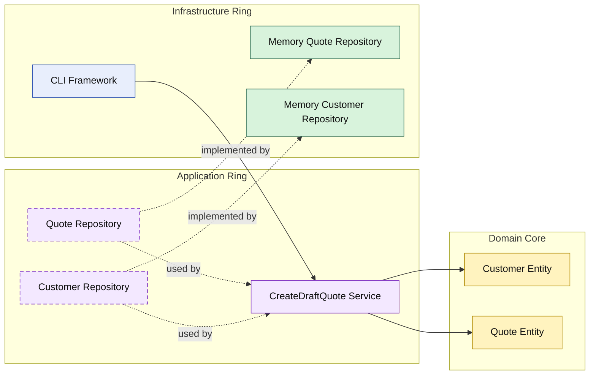
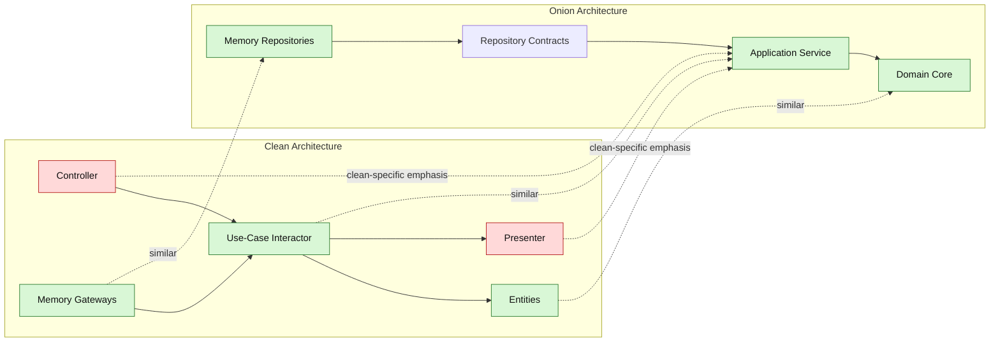

# Lesson 001: Onion Architecture Skeleton

## Objective

Build the first runnable slice of the application in Onion Architecture and make the concentric dependency rule visible through a domain core, an application ring, and outer infrastructure.

## Theory

Onion Architecture organizes the system as concentric rings around the domain model.

The key idea is not only that dependencies should point inward.

It is also that the closer code is to the center, the less it should know about technical concerns.

A simple Onion reading is:

- domain at the center
- application services around the domain
- infrastructure at the outside

This solves a problem that can still remain after the Clean track:

- the boundaries are explicit
- but the student can still focus more on translation roles than on the domain as the true center

Onion Architecture shifts the spotlight back to the domain and the rings around it.

The tradeoff is that it can feel a little less precise than Clean when talking about controller/presenter style translation roles.

## Why This Matters Here

For this repository, the first Onion lesson should not try to prove everything at once.

It should make one thing unmistakable:

- the domain is the innermost ring
- the application service depends on the domain
- infrastructure depends on the application service and domain
- the outer layers do not pull the domain outward

## Diagram

Legend:

- blue: framework edge
- green: data adapter
- purple: application ring
- yellow: domain core
- dashed border: interface / contract
- dashed arrow: structural relationship such as `used by` or `implemented by`

## Clean Vs Onion View

The first Onion slice solves the same business problem as the first Clean slice, but the emphasis moves.

Green nodes below represent broadly similar responsibilities.

Red nodes represent places where Clean usually makes finer-grained distinctions earlier than Onion does in this first step.

## Similarities And Differences

Similar structure:

- both keep business logic away from frameworks
- both make dependencies point inward
- both allow in-memory infrastructure to be swapped later
- both keep quote creation testable without real external systems

Different emphasis:

- Clean highlighted use-case translation roles earlier
- Onion highlights the domain-centered rings earlier
- Clean foregrounded controllers and presenters
- Onion foregrounds application service plus repository boundaries around the domain core
- in this Onion variant, the first lesson does not split request and response shaping into dedicated adapter types yet

## Implementation Focus

Implement one simple flow:

- create a draft quote

The code should show:

- domain entities `Customer` and `Quote`
- an application service `CreateDraftQuoteService`
- repository contracts in the application ring
- in-memory infrastructure implementations
- a small CLI demo that wires the rings together

Do not add quote lines, approval, HTTP, or reporting yet.

## What To Verify

- the project compiles
- `go test ./...` passes
- the demo can create a draft quote
- the domain has no dependency on application or infrastructure
