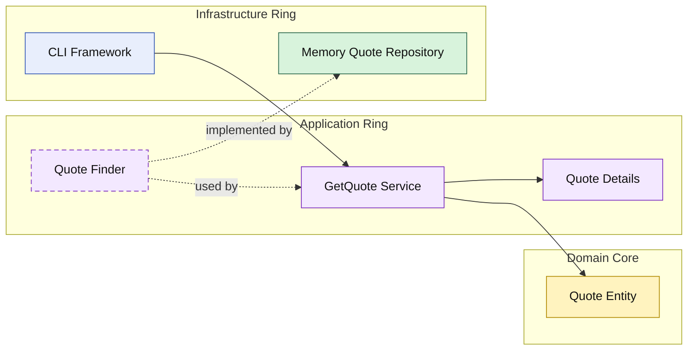

# Lesson 002: Query Application Service

## Objective

Add the first read-side application service and keep the Onion rings visible during a query flow.

## Theory

The first Onion lesson proved that the application ring can create a quote without leaking infrastructure into the domain core.

The next question is:

- how should reads happen without letting callers reach straight into infrastructure?

Onion Architecture answers that the same way it answered commands:

- the application ring owns the use case
- the application ring owns the repository contract it needs
- infrastructure implements that contract from the outside

So even a simple query should still pass through the inner rings instead of letting storage shape the API directly.

## Why This Matters Here

If the CLI or a future HTTP layer reads the memory repository directly, the read path stops teaching Onion Architecture.

Adding a query application service keeps the lesson consistent:

- the domain remains central
- the application ring still defines the boundary
- infrastructure is still only an implementation detail

## Diagram

Legend:

- blue: framework edge
- green: data adapter
- purple: application ring
- yellow: domain core
- dashed border: interface / contract
- dashed arrow: structural relationship

## What Changes Compared With Clean

This still looks close to the Clean read flow, but the emphasis stays different.

The main point here is not:

- controller input
- presenter output

The main point is:

- queries still belong to the application ring
- the application ring still protects the domain from storage details

The result is a simpler early read model that still respects the Onion dependency rule.

## Implementation Focus

Implement one simple read use case:

- get quote by id

The code should show:

- a query application service
- an application-owned quote lookup contract
- a query result model in the application ring
- an in-memory repository implementation of the query contract
- a demo that creates a quote and then reloads it

## What To Verify

- `go test ./...` passes
- the demo can create a quote and then load it again
- the CLI still depends on the application ring, not directly on the repository internals
