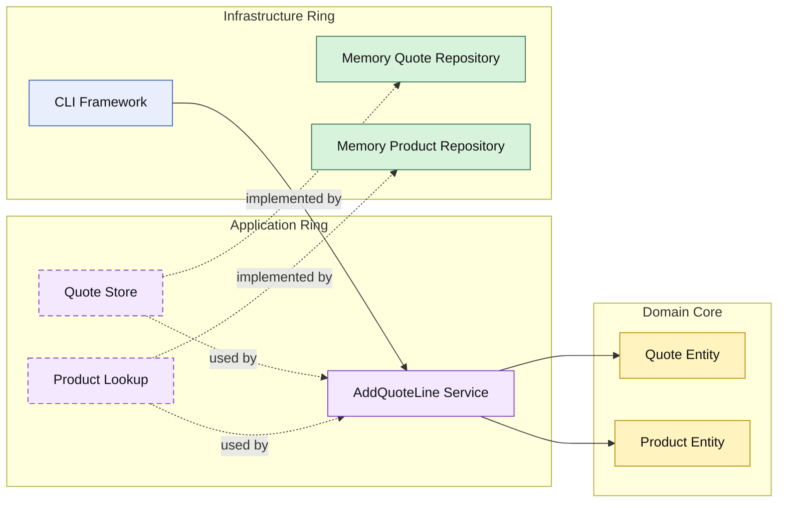

# Lesson 003: Add Quote Line With Product Lookup

## Objective

Add the first application service that coordinates multiple repository contracts and mutates an existing domain entity.

## Theory

The first Onion lessons established:

- a command service for quote creation
- a query service for quote retrieval

The next useful step is to update an existing aggregate.

That matters because Onion Architecture is not only about keeping infrastructure outside.

It is also about making the domain core hold the real business change while the application ring coordinates the workflow around it.

In this lesson:

- the application ring loads the quote
- the application ring loads the product
- the domain entity decides whether the line can be added
- the updated quote is saved back through the repository contract

## Why This Matters Here

Without this step, the Onion track still only shows create and read.

Adding a quote line makes the rings more meaningful:

- infrastructure still provides data
- application still orchestrates
- domain still owns the business change

That is the first point where the Onion style starts to feel more domain-centered than a simple CRUD shell.

## Diagram

Legend:

- blue: framework edge
- green: data adapter
- purple: application ring
- yellow: domain core
- dashed border: interface / contract
- dashed arrow: structural relationship

## Implementation Focus

Implement one update use case:

- add quote line

The code should show:

- a `Product` domain concept
- line behavior on the `Quote` entity
- an application service that coordinates quote and product repositories
- in-memory product infrastructure
- an updated query result that shows line count

## What To Verify

- `go test ./...` passes
- the demo can create a quote, add a line, and load it again
- quote mutation rules live on the domain entity instead of in the repository or CLI
