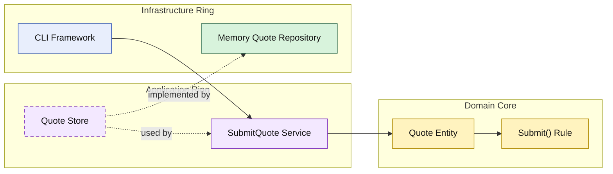

# Lesson 004: Submit Quote State Transition

## Objective

Move the first lifecycle rule into the domain core by making quote submission an explicit state transition on the `Quote` entity.

## Theory

The previous Onion lessons showed:

- create a quote
- read a quote
- add lines to a quote

But the quote was still just a mutable container with a status field.

Onion Architecture becomes more meaningful when the domain core owns actual lifecycle rules.

In this lesson:

- the application ring still loads and saves the quote
- the domain entity decides whether submission is valid
- infrastructure remains a passive persistence detail

That is an important Onion move:

- orchestration stays in the application ring
- invariants stay in the domain core

## Why This Matters Here

If the application service decides by itself whether a quote can be submitted, then the domain is still thinner than it should be.

Putting submission on the entity makes the core more central:

- only draft quotes can be submitted
- empty quotes cannot be submitted
- once submitted, the quote is no longer editable

Those are domain rules, not storage rules and not CLI rules.

## Diagram

Legend:

- blue: framework edge
- green: data adapter
- purple: application ring
- yellow: domain core
- dashed border: interface / contract
- dashed arrow: structural relationship

## Implementation Focus

Implement one lifecycle use case:

- submit quote

The code should show:

- domain submission rules on `Quote`
- an application service that loads, submits, and saves
- the existing add-line path now respecting the submitted state
- the demo creating a quote, adding a line, submitting it, and loading it again

## What To Verify

- `go test ./...` passes
- a quote with lines can be submitted
- an empty quote cannot be submitted
- a submitted quote can no longer be edited
