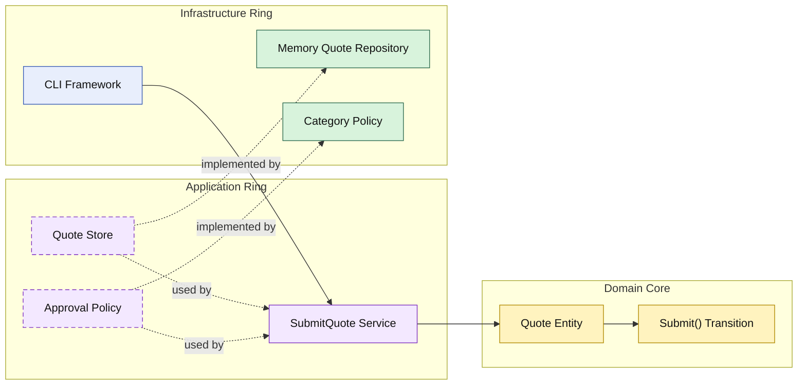

# Lesson 005: Approval Policy Boundary

## Objective

Introduce the first external business policy seam while keeping quote submission itself inside the domain core.

## Theory

The previous lesson moved the submission transition into the `Quote` entity.

That solved one problem:

- lifecycle rules no longer lived in the application service

But another problem remains:

- some submission outcomes depend on business policy that may change more often than the core lifecycle rule

In this lesson:

- the domain still owns submission
- the application ring asks a policy contract whether approval is required
- infrastructure provides one concrete policy implementation

This is a good Onion example because it keeps two concerns separate:

- the entity owns how submission changes state
- the policy decides which submission path applies

## Why This Matters Here

If the domain entity hard-codes category-specific approval rules immediately, the core can become too coupled to one policy variant.

If the application service hard-codes the whole transition instead, the core becomes too weak again.

The Onion answer is:

- keep the state transition on the entity
- keep the changing rule behind an inward-facing contract

## Diagram

Legend:

- blue: framework edge
- green: data adapter
- purple: application ring
- yellow: domain core
- dashed border: interface / contract
- dashed arrow: structural relationship

## Implementation Focus

Implement one policy-aware workflow:

- submit quote with approval decision

The code should show:

- quote lines carrying enough information for policy evaluation
- a policy contract in the application ring
- a category-based policy implementation in infrastructure
- submission ending in either `Approved` or `PendingApproval`

## What To Verify

- `go test ./...` passes
- standard quotes become `Approved`
- custom-build quotes become `PendingApproval`
- the submission state transition still belongs to the `Quote` entity
