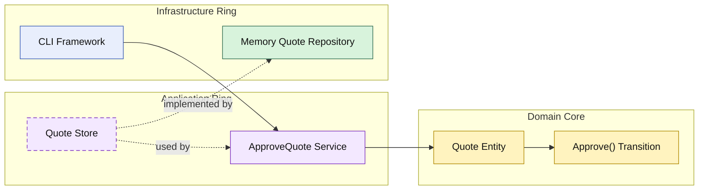

# Lesson 006: Approve Pending Quote

## Objective

Separate the approval decision from the approval action by adding an explicit use case that moves a `PendingApproval` quote to `Approved`.

## Theory

Lesson `005` introduced a policy boundary that decides whether submission goes straight to `Approved` or stops at `PendingApproval`.

That still leaves one missing part:

- what actually performs the approval action?

Onion Architecture keeps the answer consistent:

- the application ring orchestrates the workflow
- the domain core owns the state transition
- infrastructure only persists the result

This keeps the concepts distinct:

- the policy determines whether review is required
- the entity determines whether approval is valid
- the application service performs the use case

## Why This Matters Here

Without an explicit approval action, `PendingApproval` is only a label, not a real workflow state.

Adding `Approve()` makes the state meaningful:

- draft quotes can be edited
- submitted quotes may stop at pending approval
- only pending quotes can be approved

That makes the domain lifecycle clearer and gives the Onion rings another concrete responsibility split.

## Diagram

Legend:

- blue: framework edge
- green: data adapter
- purple: application ring
- yellow: domain core
- dashed border: interface / contract
- dashed arrow: structural relationship

## Implementation Focus

Implement one new workflow step:

- approve pending quote

The code should show:

- an `Approve()` transition on the `Quote` entity
- an application service for quote approval
- tests for valid and invalid approval transitions
- a demo branch that submits a custom-build quote and then approves it

## What To Verify

- `go test ./...` passes
- pending quotes can be approved
- already approved quotes cannot be approved again
- the approval transition remains in the domain core
